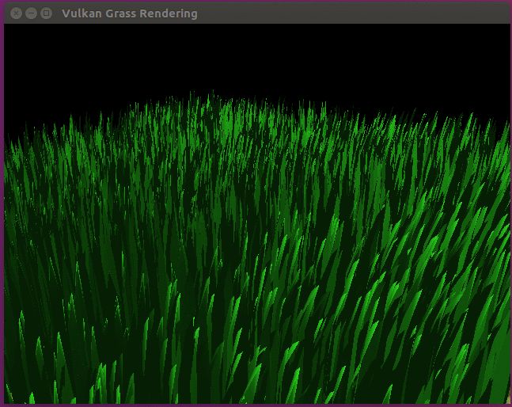
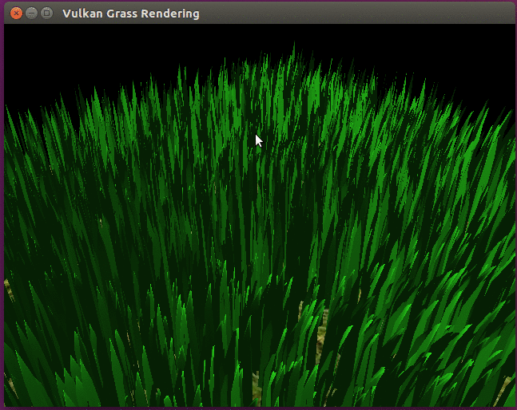
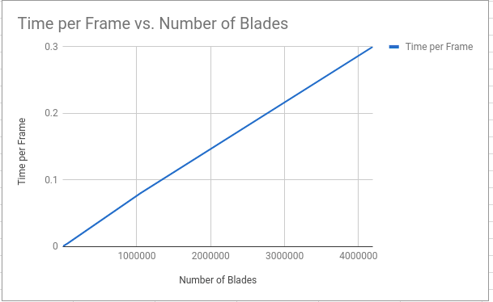
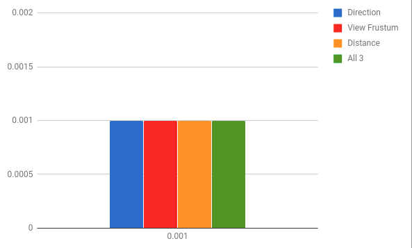

Vulkan Grass Rendering
========================

**University of Pennsylvania, CIS565: GPU Programming and Architecture, Project 6**

* Alexander Perry
* Tested on: Ubuntu 16.04, i7-5600U @ 2.6GHz 8GB, Intel HD Graphics 5500 (personal computer)

This project is an implementation of the paper, [Responsive Real-Time Grass Rendering for General 3D Scenes](https://www.cg.tuwien.ac.at/research/publications/2017/JAHRMANN-2017-RRTG/JAHRMANN-2017-RRTG-draft.pdf).

### Representing Grass as Bezier Curves

In this project, grass blades are be represented as Bezier curves while performing physics calculations and culling operations. 
Each Bezier curve has three control points.
* `v0`: the position of the grass blade on the geomtry
* `v1`: a Bezier curve guide that is always "above" `v0` with respect to the grass blade's up vector (explained soon)
* `v2`: a physical guide for which we simulate forces on

We also need to store per-blade characteristics that will help us simulate and tessellate our grass blades correctly.
* `up`: the blade's up vector, which corresponds to the normal of the geometry that the grass blade resides on at `v0`
* Orientation: the orientation of the grass blade's face
* Height: the height of the grass blade
* Width: the width of the grass blade's face
* Stiffness coefficient: the stiffness of our grass blade, which will affect the force computations on our blade

We can pack all this data into four `vec4`s, such that `v0.w` holds orientation, `v1.w` holds height, `v2.w` holds width, and 
`up.w` holds the stiffness coefficient.

### Simulating Forces

In this project, forces on grass blades are simulated while they are still Bezier curves. This is done in a compute
shader using the compute pipeline.`v2` is our physical guide, so we will be
applying transformations to `v2` initially, then correcting for potential errors. We will finally update `v1` to maintain the appropriate
length of our grass blade.

### Culling tests

Although we need to simulate forces on every grass blade at every frame, there are many blades that we won't need to render
due to a variety of reasons.

#### Orientation culling

Consider the scenario in which the front face direction of the grass blade is perpendicular to the view vector. Since our grass blades
won't have width, we will end up trying to render parts of the grass that are actually smaller than the size of a pixel. This could
lead to aliasing artifacts.

In order to remedy this, we can cull these blades. we simply do a dot product test to see if the view vector and front face direction of
the blade are close to  perpendicular.

#### View-frustum culling

We also want to cull blades that are outside of the view-frustum, considering they won't show up in the frame anyway. To determine if
a grass blade is in the view-frustum, we want to compare the visibility of three points: `v0, v2, and m`, where `m = (1/4)v0 * (1/2)v1 * (1/4)v2`.
Notice that we aren't using `v1` for the visibility test. This is because the `v1` is a Bezier guide that doesn't represent a position on the grass blade.
We instead use `m` to approximate the midpoint of our Bezier curve.

If all three points are outside of the view-frustum, we will cull the grass blade.

#### Distance culling

The further a blade of grass is, the fewer we need at that depth to see it properly. This allows for a simple heuristic where the further away a blade of grass is, the more likely it is to be culled.

### Tessellating Bezier curves into grass blades

In this project, each Bezier curve is passed as a single patch to be processed by the grass graphics pipeline. This patch is tesselated into 
a quad with the shape of a triangle

### Performance Analysis

#### Number of Blades

The performance scales essentially linearly with the number of blades which makes sense. Each blade takes equivalent processing time so adding more linearly increases the workload on the GPU.

Once the number of blades passed 2^20, the simulation essentially broke as the delta time was too great for the simulation to meaningfull.

#### Culling Tests
All of these tests were done with 2^13 blades.

I noticed no effect on performace from culling. Neither at lower numbers of blades, nor at high numbers of blades. I noticed some improvement when each culling method was "overperforming". For example, if I zoomed out so that distance culling removed most of the blades, there was significant speed up. The other situation that led to significant speed up was looking straight down as the view culling was highly effective. Other than those two cases, performance was the same within measrement margin. 
I suspect this is due to the limited perfomance available on my computer with a netbook processor and onboard GPU.
