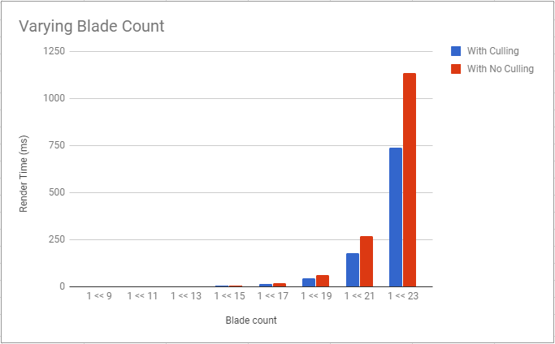
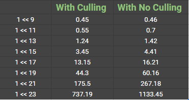
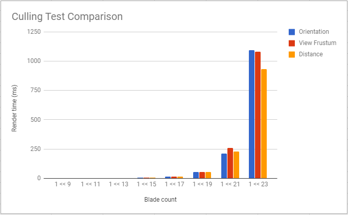
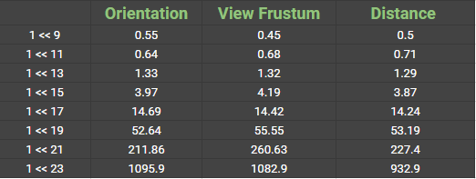

Vulkan Grass Rendering
======================

**University of Pennsylvania, CIS 565: GPU Programming and Architecture, Project 6**

* Name: Meghana Seshadri
* Tested on: Windows 10, i7-4870HQ @ 2.50GHz 16GB, GeForce GT 750M 2048MB (personal computer)

## Project Overview

The goal of this project was to get an introduction to Vulkan by implementing a grass simulator and renderer. [Vulkan](https://www.khronos.org/vulkan/) is graphics and compute API that is cross-platform. It is populary used amongst real-time 3D applications such as video games and other interactive media as it offers higher performance.  

This project is an implementation of the paper, [Responsive Real-Time Grass Rendering for General 3D Scenes](https://www.cg.tuwien.ac.at/research/publications/2017/JAHRMANN-2017-RRTG/JAHRMANN-2017-RRTG-draft.pdf).

In this project, compute shaders were used to perform physics calculations on Bezier curves that represent individual grass blades. Since rendering every grass blade on every frame will is fairly inefficient, we also use compute shaders to cull grass blades that don't contribute to a given frame. The remaining blades are then passed to a graphics pipeline, in which several other shaders operate on them. A vertex shader is used to transform Bezier control points, tessellation shaders to dynamically create the grass geometry from the Bezier curves, and a fragment shader to shade the grass blades.

## Features

- Representing grass as Bezier curves

- Simulating forces
  - Gravity
  - Recovery 
  - Wind

- Culling tests
  - Orientation culling
  - View-frustum culling
  - Distance culling

- Tessellating Bezier curves into grass blades

'''Look at the Appendix section below for further explanation of the above features.'''

## Performance Analysis

### Varying blade count 

When rendering frames with varying blade count, there seems to be a huge spike after 1 << 21 blades (2097152). 

### Culling test comparison

Here also, there seems to be a huge spike after 1 << 21 blades (2097152). What's interesting to note is that the culling tests don't seem to perform much differently from each other until you get to 1 << 21 number of blades. But even at 1 << 23, this varies a lot. From View Frustum not being the most optimized, the orientation culling technique becomes the least optimized at 1 << 23 blades.

## Resources

### Links

The following resources were useful for this project.

* [Responsive Real-Time Grass Grass Rendering for General 3D Scenes](https://www.cg.tuwien.ac.at/research/publications/2017/JAHRMANN-2017-RRTG/JAHRMANN-2017-RRTG-draft.pdf)
* [CIS565 Vulkan samples](https://github.com/CIS565-Fall-2017/Vulkan-Samples)
* [Official Vulkan documentation](https://www.khronos.org/registry/vulkan/)
* [Vulkan tutorial](https://vulkan-tutorial.com/)
* [RenderDoc blog on Vulkan](https://renderdoc.org/vulkan-in-30-minutes.html)
* [Tessellation tutorial](http://in2gpu.com/2014/07/12/tessellation-tutorial-opengl-4-3/)

* [Calculating wind](https://www.cg.tuwien.ac.at/research/publications/2013/JAHRMANN-2013-IGR/JAHRMANN-2013-IGR-paper.pdf)
* [Orientation culling](https://gamedev.stackexchange.com/questions/22283/how-to-get-translation-from-view-matrix)
* [AtomicAdd](http://www.nvidia.com/content/siggraph/Rollin_Oster_OpenGL_CUDA.pdf
* [Tessellation control shader](https://www.khronos.org/opengl/wiki/Tessellation_Control_Shader)
* [Tessellation evaluation shader](https://www.khronos.org/opengl/wiki/Tessellation_Evaluation_Shader)

* Getting front facing direction
  - [Converting angle radians to heading vector](https://math.stackexchange.com/questions/180874/convert-angle-radians-to-a-heading-vector)
  - [Get orientation from vectors](https://www.opengl.org/discussion_boards/showthread.php/178287-Get-orientation-from-vectors)
  - [Cross product](https://en.wikipedia.org/wiki/Cross_product)

## Grass Rendering - Appendix

This project is an implementation of the paper, [Responsive Real-Time Grass Rendering for General 3D Scenes](https://www.cg.tuwien.ac.at/research/publications/2017/JAHRMANN-2017-RRTG/JAHRMANN-2017-RRTG-draft.pdf).
Please make sure to use this paper as a primary resource while implementing your grass renderers. It does a great job of explaining
the key algorithms and math you will be using. Below is a brief description of the different components in chronological order of how your renderer will
execute, but feel free to develop the components in whatever order you prefer.

### Representing Grass as Bezier Curves

In this project, grass blades will be represented as Bezier curves while performing physics calculations and culling operations. 
Each Bezier curve has three control points.
* `v0`: the position of the grass blade on the geomtry
* `v1`: a Bezier curve guide that is always "above" `v0` with respect to the grass blade's up vector (explained soon)
* `v2`: a physical guide for which we simulate forces on

We also need to store per-blade characteristics that will help us simulate and tessellate our grass blades correctly.
* `up`: the blade's up vector, which corresponds to the normal of the geometry that the grass blade resides on at `v0`
* Orientation: the orientation of the grass blade's face
* Height: the height of the grass blade
* Width: the width of the grass blade's face
* Stiffness coefficient: the stiffness of our grass blade, which will affect the force computations on our blade

We can pack all this data into four `vec4`s, such that `v0.w` holds orientation, `v1.w` holds height, `v2.w` holds width, and 
`up.w` holds the stiffness coefficient.

### Simulating Forces

In this project, you will be simulating forces on grass blades while they are still Bezier curves. This will be done in a compute
shader using the compute pipeline that has been created for you. Remember that `v2` is our physical guide, so we will be
applying transformations to `v2` initially, then correcting for potential errors. We will finally update `v1` to maintain the appropriate
length of our grass blade.

#### Binding Resources

In order to update the state of your grass blades on every frame, you will need to create a storage buffer to maintain the grass data.
You will also need to pass information about how much time has passed in the simulation and the time since the last frame. To do this,
you can extend or create descriptor sets that will be bound to the compute pipeline.

#### Gravity

Given a gravity direction, `D.xyz`, and the magnitude of acceleration, `D.w`, we can compute the environmental gravity in
our scene as `gE = normalize(D.xyz) * D.w`.

We then determine the contribution of the gravity with respect to the front facing direction of the blade, `f`, 
as a term called the "front gravity". Front gravity is computed as `gF = (1/4) * ||gE|| * f`.

We can then determine the total gravity on the grass blade as `g = gE + gF`.

#### Recovery

Recovery corresponds to the counter-force that brings our grass blade back into equilibrium. This is derived in the paper using Hooke's law.
In order to determine the recovery force, we need to compare the current position of `v2` to its original position before
simulation started, `iv2`. At the beginning of our simulation, `v1` and `v2` are initialized to be a distance of the blade height along the `up` vector.

Once we have `iv2`, we can compute the recovery forces as `r = (iv2 - v2) * stiffness`.

#### Wind

In order to simulate wind, you are at liberty to create any wind function you want! In order to have something interesting,
you can make the function depend on the position of `v0` and a function that changes with time. Consider using some combination
of sine or cosine functions.

Your wind function will determine a wind direction that is affecting the blade, but it is also worth noting that wind has a larger impact on
grass blades whose forward directions are parallel to the wind direction. The paper describes this as a "wind alignment" term. We won't go 
over the exact math here, but use the paper as a reference when implementing this. It does a great job of explaining this!

Once you have a wind direction and a wind alignment term, your total wind force (`w`) will be `windDirection * windAlignment`.

#### Total force

We can then determine a translation for `v2` based on the forces as `tv2 = (gravity + recovery + wind) * deltaTime`. However, we can't simply
apply this translation and expect the simulation to be robust. Our forces might push `v2` under the ground! Similarly, moving `v2` but leaving
`v1` in the same position will cause our grass blade to change length, which doesn't make sense.

Read section 5.2 of the paper in order to learn how to determine the corrected final positions for `v1` and `v2`. 

### Culling tests

Although we need to simulate forces on every grass blade at every frame, there are many blades that we won't need to render
due to a variety of reasons. Here are some heuristics we can use to cull blades that won't contribute positively to a given frame.

#### Orientation culling

Consider the scenario in which the front face direction of the grass blade is perpendicular to the view vector. Since our grass blades
won't have width, we will end up trying to render parts of the grass that are actually smaller than the size of a pixel. This could
lead to aliasing artifacts.

In order to remedy this, we can cull these blades! Simply do a dot product test to see if the view vector and front face direction of
the blade are perpendicular. The paper uses a threshold value of `0.9` to cull, but feel free to use what you think looks best.

#### View-frustum culling

We also want to cull blades that are outside of the view-frustum, considering they won't show up in the frame anyway. To determine if
a grass blade is in the view-frustum, we want to compare the visibility of three points: `v0, v2, and m`, where `m = (1/4)v0 * (1/2)v1 * (1/4)v2`.
Notice that we aren't using `v1` for the visibility test. This is because the `v1` is a Bezier guide that doesn't represent a position on the grass blade.
We instead use `m` to approximate the midpoint of our Bezier curve.

If all three points are outside of the view-frustum, we will cull the grass blade. The paper uses a tolerance value for this test so that we are culling
blades a little more conservatively. This can help with cases in which the Bezier curve is technically not visible, but we might be able to see the blade
if we consider its width.

#### Distance culling

Similarly to orientation culling, we can end up with grass blades that at large distances are smaller than the size of a pixel. This could lead to additional
artifacts in our renders. In this case, we can cull grass blades as a function of their distance from the camera.

You are free to define two parameters here.
* A max distance afterwhich all grass blades will be culled.
* A number of buckets to place grass blades between the camera and max distance into.

Define a function such that the grass blades in the bucket closest to the camera are kept while an increasing number of grass blades
are culled with each farther bucket.

### Tessellating Bezier curves into grass blades

In this project, you should pass in each Bezier curve as a single patch to be processed by your grass graphics pipeline. You will tessellate this patch into 
a quad with a shape of your choosing (as long as it looks sufficiently like grass of course). The paper has some examples of grass shapes you can use as inspiration.

In the tessellation control shader, specify the amount of tessellation you want to occur. Remember that you need to provide enough detail to create the curvature of a grass blade.

The generated vertices will be passed to the tessellation evaluation shader, where you will place the vertices in world space, respecting the width, height, and orientation information
of each blade. Once you have determined the world space position of each vector, make sure to set the output `gl_Position` in clip space!

** Extra Credit**: Tessellate to varying levels of detail as a function of how far the grass blade is from the camera. For example, if the blade is very far, only generate four vertices in the tessellation control shader.

To build more intuition on how tessellation works, I highly recommend playing with the [helloTessellation sample](https://github.com/CIS565-Fall-2017/Vulkan-Samples/tree/master/samples/5_helloTessellation)
and reading this [tutorial on tessellation](http://in2gpu.com/2014/07/12/tessellation-tutorial-opengl-4-3/).
