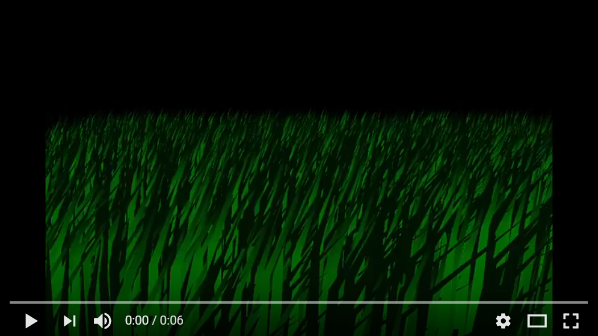
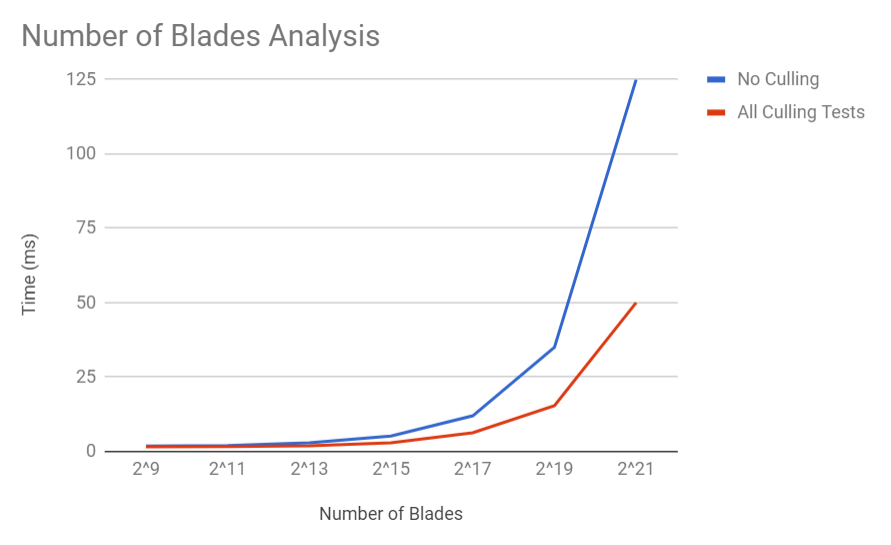
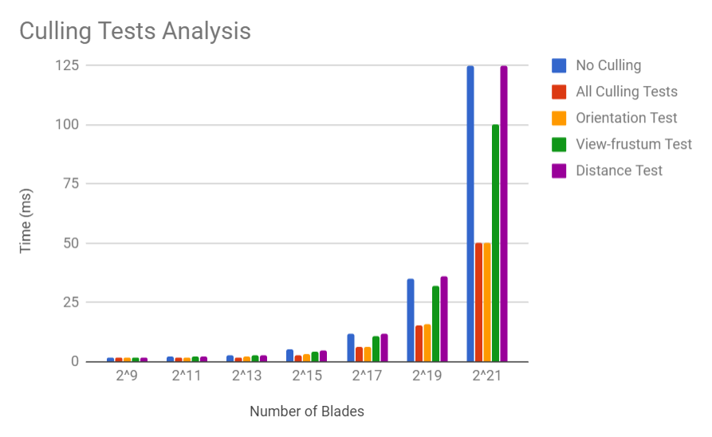

Vulkan Grass Rendering
======================

**University of Pennsylvania, CIS 565: GPU Programming and Architecture, Project 6**

* Ricky Rajani
* Tested on: Windows 10, i5-6200U @ 2.30GHz, Intel(R) HD Graphics 520 4173MB (Personal Computer)

This project is an implementation of the paper, [Responsive Real-Time Grass Rendering for General 3D Scenes](https://www.cg.tuwien.ac.at/research/publications/2017/JAHRMANN-2017-RRTG/JAHRMANN-2017-RRTG-draft.pdf).

### Features
- Compute shader
	- Perform physics calculations on Bezier curves that represent individual grass blades
	- Culling tests (orientation, view-frustum, distance)
- Grass pipeline stages
	- Vertex shader to transform Bezier control points
	- Tessellation shaders (control and evaluation) to dynamically create the grass geometry from the Bezier curves
	- Fragment shader to shade the grass blades
	
### Culling tests

Although we need to simulate forces on every grass blade at every frame, there are many blades that we won't need to render
due to a variety of reasons. Here are some heuristics we can use to cull blades that won't contribute positively to a given frame.

#### Orientation culling

Consider the scenario in which the front face direction of the grass blade is perpendicular to the view vector. Since our grass blades
won't have width, we will end up trying to render parts of the grass that are actually smaller than the size of a pixel. This could
lead to aliasing artifacts. In order to remedy this, we can cull these blades!

#### View-frustum culling

We also want to cull blades that are outside of the view-frustum, considering they won't show up in the frame anyway. 

#### Distance culling

Similarly to orientation culling, we can end up with grass blades that at large distances are smaller than the size of a pixel. This could lead to additional
artifacts in our renders. In this case, we can cull grass blades as a function of their distance from the camera.

### Tessellating Bezier curves into grass blades

Each Bezier curve is passed in as a single patch to be processed by the grass graphics pipeline. This patch will tessellate into 
a quad. 
### Performance Analysis

Clearly, as the number of blades increases, the performance of the renderer decreases. And using the culling tests improves performance significantly. The orientation test checks if a grass blade is culled if the front face direction is perpendicular to te view vector. In other words, since the grass blades won't have width then it is futile to render parts of the grass that are actually smaller than the size of a pixel.This test is the most effective culling test. Whereas the distance test doesn't seem to improve performance. This could be attributed to the plane dimensions not being large enough such that any far off blades are culled. Likewise with the view-frustum test there isn't a huge performance improvement because the plane dimensions are not big enough to cull many grass blades from the scene.

### Credits

* [Responsive Real-Time Grass Grass Rendering for General 3D Scenes](https://www.cg.tuwien.ac.at/research/publications/2017/JAHRMANN-2017-RRTG/JAHRMANN-2017-RRTG-draft.pdf)
* [Vulkan tutorial](https://vulkan-tutorial.com/)
* [Tessellation tutorial](http://in2gpu.com/2014/07/12/tessellation-tutorial-opengl-4-3/)
