Vulkan Grass Rendering
======================

**University of Pennsylvania, CIS 565: GPU Programming and Architecture, Project 6**

Sarah Forcier

Tested on GeForce GTX 1070

### Overview

This project implements a grass simulator and renderer using Vulkan. Each grass blade is represented by a quadratic Bezier curve, and physics calculations are performed on these control points in a compute shader. Since rendering every grass blade is computationally expensive, grass blades that do not contribute to a frame are culled in the computer shader. Visible grass blades are sent to a graphics pipeline where the Bezier control points are transformed, geometry is created by tesselations shaders, and the grass is shaded by the fragment shader. 

### Simulation

As mentioned above, a grass blade is represented by a Bezier curve where the first control point is fixed on the plane, and the physics calculations are performed on the third control point. Along with the three control points, a blade is also defined by an up vector and scalar height, orientation, width, and stiffness coefficient. See the diagram below for how the blade is represented.  

All the blade data can be stored in four `vec4`s by packing the scalar values into the fourth component of the control points and up vectors.  

| x | y | z | w |
| ----------- | ----------- | ----------- | ----------- |
| v0.x | v0.y | v0.z | orientation |
| v1.x | v1.y | v1.z | height |
| v2.x | v2.y | v2.z | width |
| up.x | up.y | up.z | stiffness |

#### Forces

Forces are first applied to the `v2` control point and then corrected for potential errors in the state validation step (see next section). The total force applied is the sum of the gravity, recovery, and wind forces.  

##### Gravity

The total force due to gravity is the sum of the environmental gravity and the front gravity, which is the gravity with respect to the front facing direction of the blade - computed by the orientation. 

`gE = normalize(D.xyz) * D.w`
`gF = (1/4) * ||gE|| * f`
`g = gE + gF`

##### Recovery

Grass blades act like springs, so according to Hooke's law, there is a force that brings the blade back to equilibrium. This force acts in the direction of the original `v2` position, or `iv2`, and is scaled by the stiffness coefficient. The larger the stiffness coefficient, the more force pushing the blade back to equilibrium. 

`r = (iv2 - v2) * stiffness`

##### Wind

There are many different possible wind forces. A naive approach is for all grass blades to receive the same wind force. Adding noise to this simulation gives a better look. Another scenario simulates a radial wind, like the wind blown from a landing helicopter. The wind strength and wind direction are parameters that can be changed to create a variety of scenarios. 

#### State Validation

Before `v2` can be translated, the new state must first be corrected for errors. First, `v2` must remain above `v0` because the blade cannot intersect the ground plane. In addition, the system insures that each blade always has a slight curvature, and the length of the Bezier curve is not longer than the fixed blade height. 

### Culling tests

Simulating and rendering many instances of a object is computationally expensive, so some instances are culled before rendering to optimize the algorithm. 

#### Orientation culling

Grass blades have a marginal thickness, so when the blades are viewed perpendicular to the front facing vector, the blades cannot be seen at all or the rendered parts of the blades are smaller than a pixel and would cause aliasing artifacts. Therefore blades oriented as such an angle are culled before rendering. 

| ----------- | ----------- | ----------- | 
| 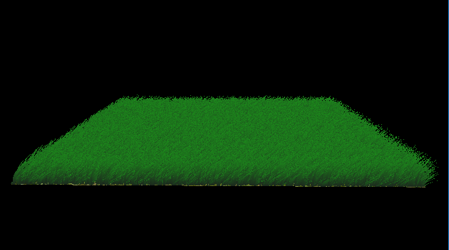 | 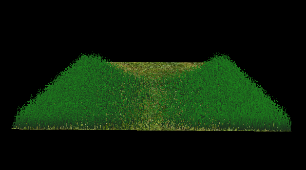 | 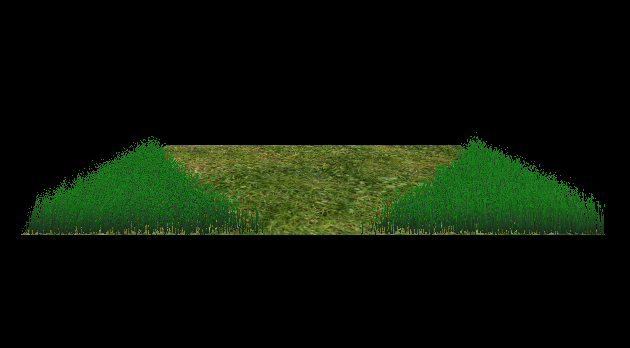 | 
| 65,536 | 50,064 | 19,366 | 

The above scene is shown at three different viewing angles and all the blades in the scene are facing the same direction. When viewed head on (left), all the blades are rendered, but as the scene rotates, blades are culled based on their orientation with respect to the camera. 

#### View-frustum culling

We also want to cull blades that are outside of the view-frustum, since they are not visible in the frame anyway. To determine if a blade is in frame, we compare the visibility of the first and last control points and a weighted midpoint instead of `v1` because `v1` does not lie on the curve.  

| ----------- | ----------- | ----------- | ----------- | 
| 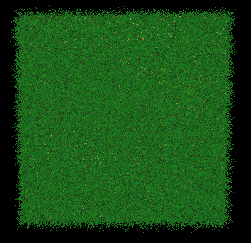 | 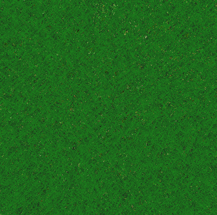 | 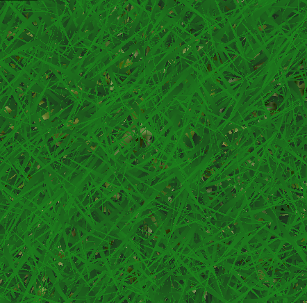 | 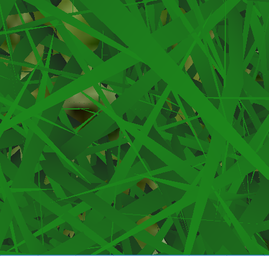 | 
| 65,536 | 51,930 | 6,692 | 1,942 | 

As camera zooms in on the scene, more blades move outside of the viewing frustum and less blades are rendered. 

#### Distance culling

Similarly to orientation culling, grass blades at large distances from the camera can be smaller than the size of a pixel and can lead to aliasing problems. To solve this, we reduce grass density far away from the camera. 

| ----------- | ----------- | ----------- | ----------- | 
| 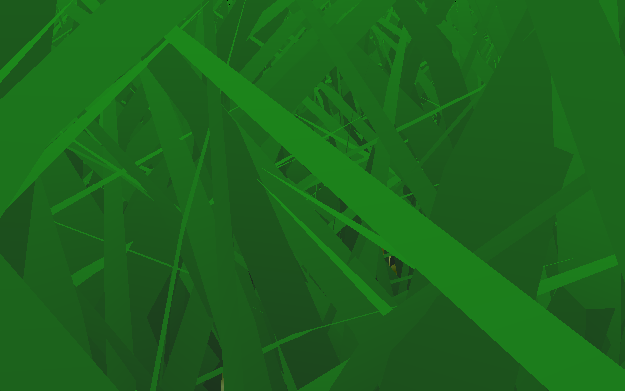 | 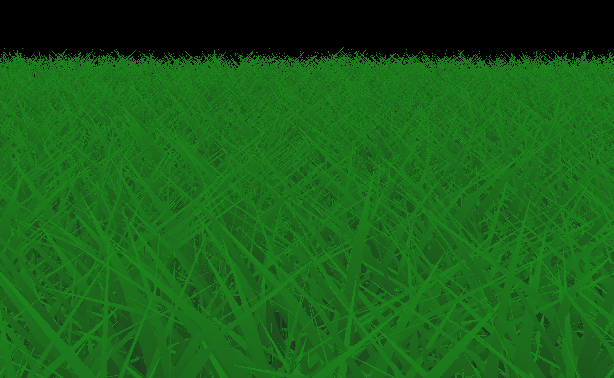 | 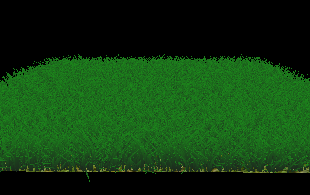 | 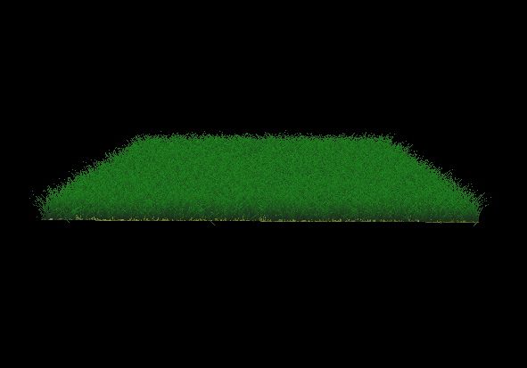 | 
| 61,239 | 56,621 | 47,415 | 36,321 | 

When the camera is zoomed in, few blades of grass are culled from the maximum number of instances (65,536), but as we zoom out, we can decrease the grass density without sacrificing realism: the right image does not appear less dense than the first two even though it has ~10,000 less blades of grass. The comparison of rendered blade count is restricted to only distance culling, even though in the full pipeline, the first image would also cull outside of the view frustum.   

### Tessellation

When the blades of grass are view from afar, it is not necessary to tesselate them to the same level of detail as if they are viewed up close. The following animation illustrates how the tesselation changes as the distance from the camera changes. 

### Performance

Maximum performance is achieved when the compute shader culls blades based on all three criteria described above. According to the chart, frustum culling provides the most optimization. However this metric is frame dependent because as shown above, no optimization based on frustum culling can be achieve when all the blades are visible in frame. 

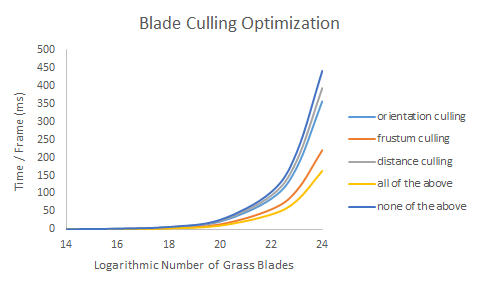

### Credits

* [Responsive Real-Time Grass Grass Rendering for General 3D Scenes](https://www.cg.tuwien.ac.at/research/publications/2017/JAHRMANN-2017-RRTG/JAHRMANN-2017-RRTG-draft.pdf)