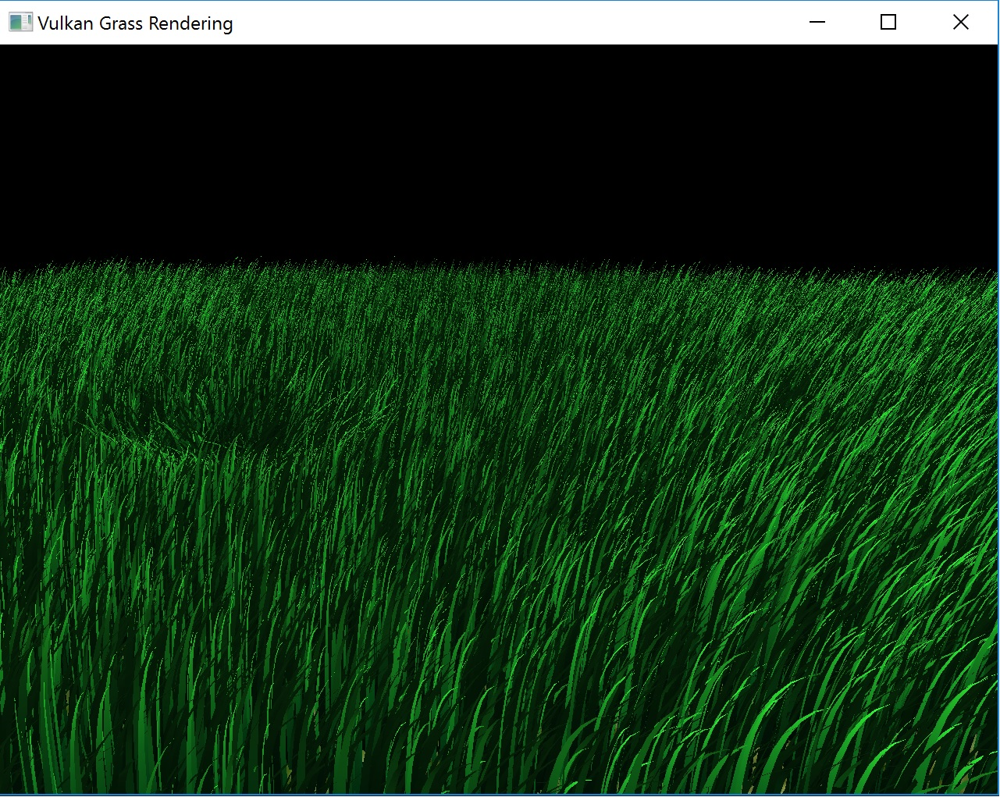
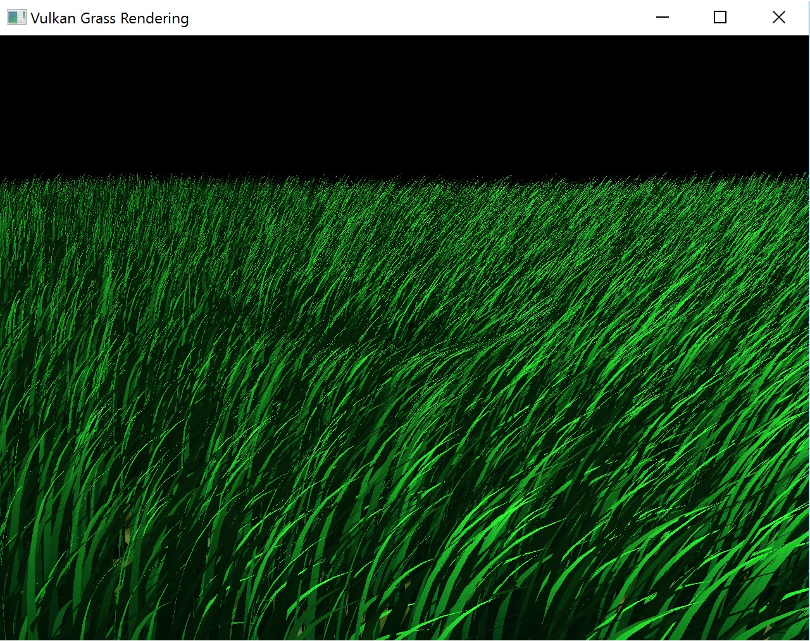
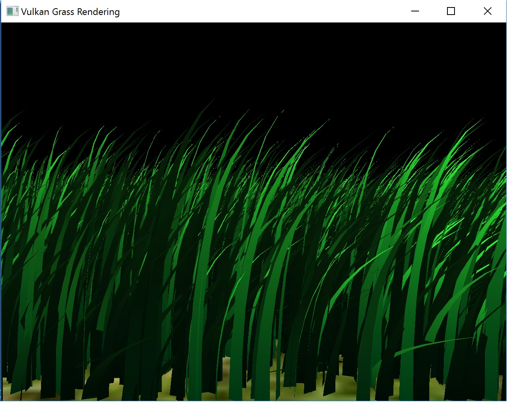
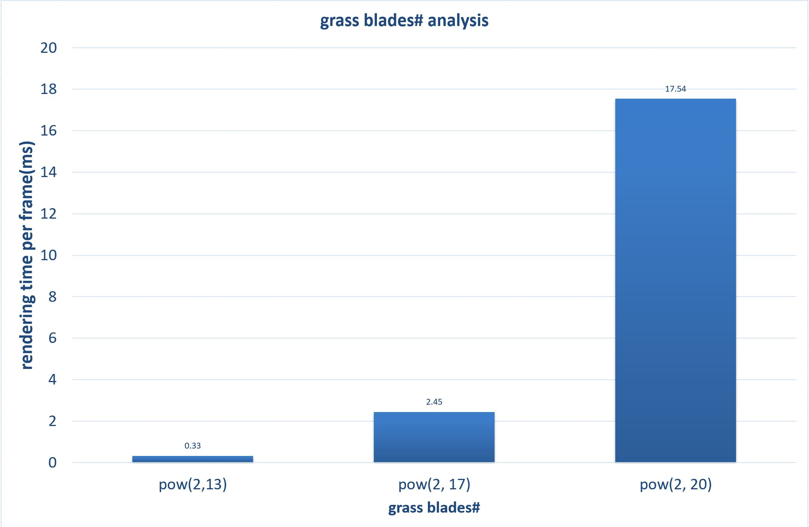
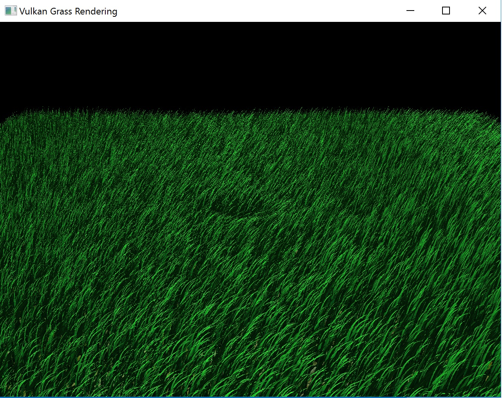
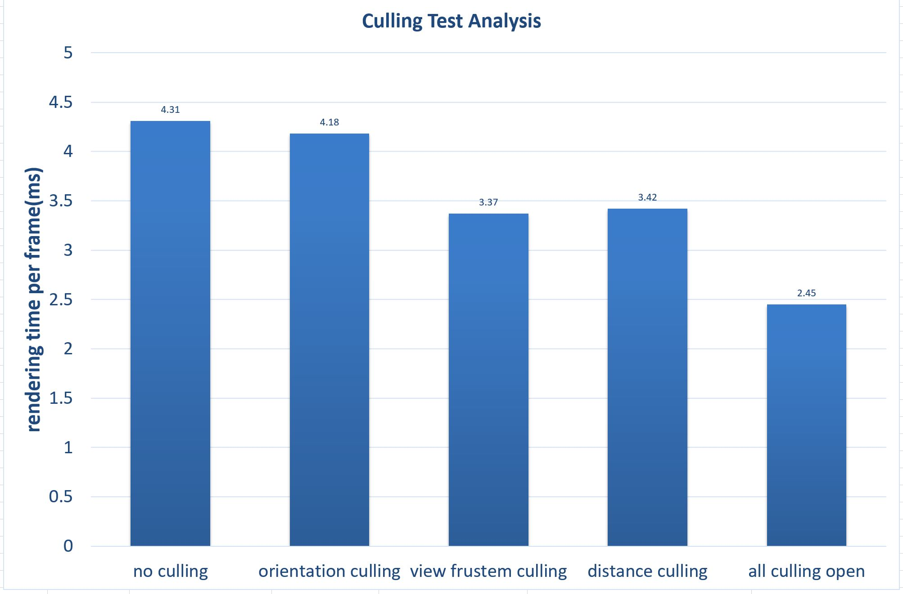
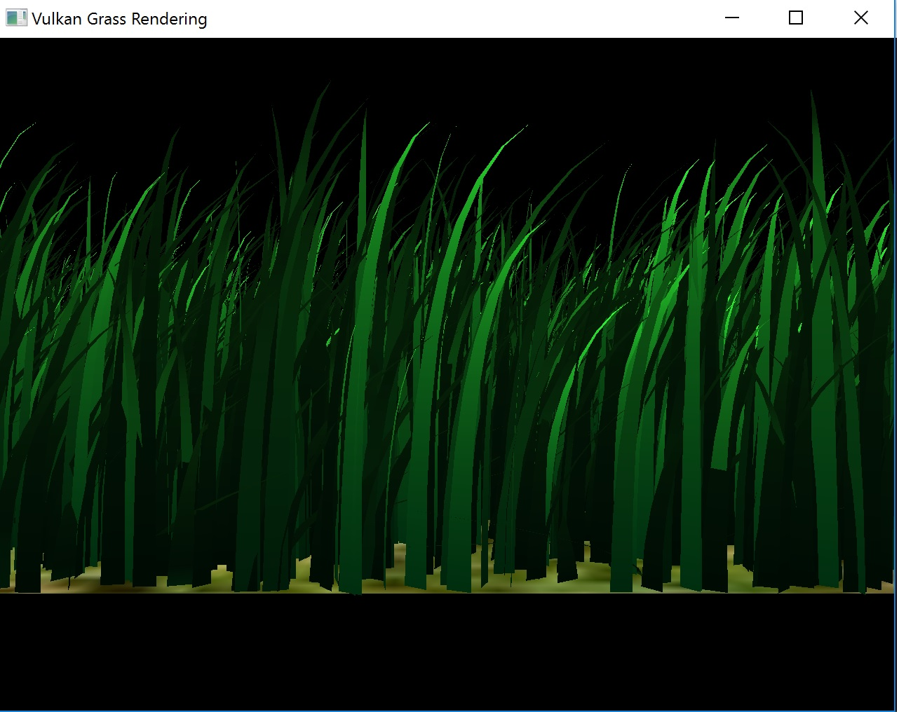
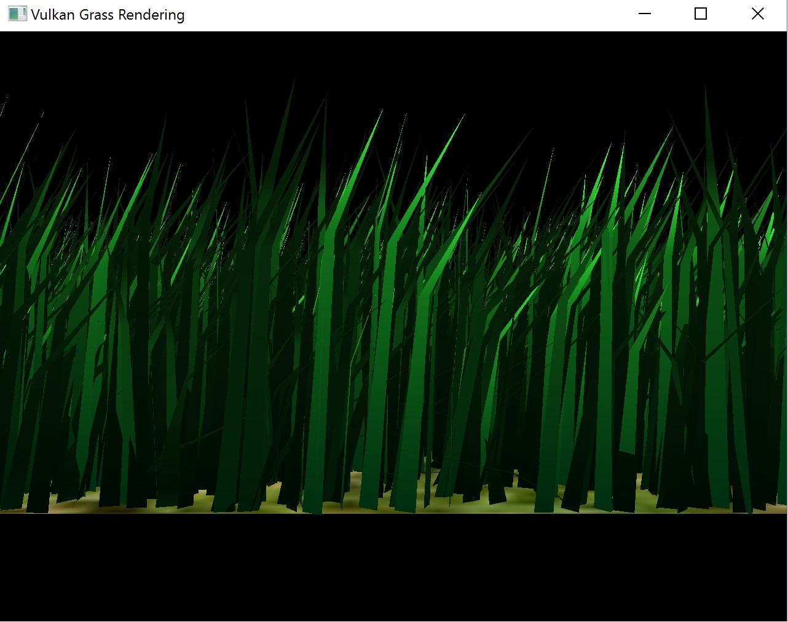
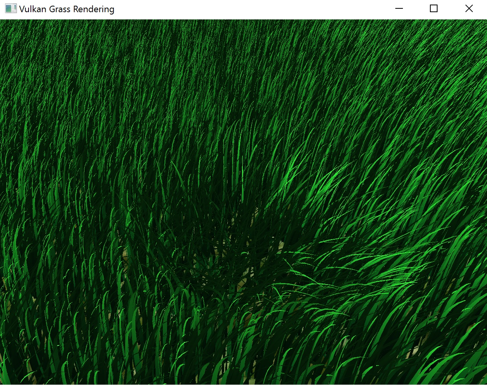

Vulkan Grass Rendering
========================

**University of Pennsylvania, CIS 565: GPU Programming and Architecture, Project 6**

* Hanming Zhang
* Tested on: Windows 10 Education, i7-6700K @ 4.00GHz 16.0GB, GTX 980 4096MB (Personal Desktop)

### Demo Video

Project Features
================

### **Summary:**
This project use Vulkan to implement a grass simulator and renderer. Basically, this project is an implementation of the paper, [Responsive Real-Time Grass Rendering for General 3D Scenes](https://www.cg.tuwien.ac.at/research/publications/2017/JAHRMANN-2017-RRTG/JAHRMANN-2017-RRTG-draft.pdf). Compute shaders are used to perform physics calculations on Bezier curves that represent individual
grass blades in the application. Since rendering every grass blade on every frame will is fairly
inefficient, compute shaders are also used to cull grass blades that don't contribute to a given frame.
The remaining blades will be passed to a graphics pipeline.

### Screenshoots:
 |  
------------ | -------------
broad view | detail view

### Compute shader
  - Calculate forces applied to grass blades, which include gravity, recovery force and natural wind force. Also, blades translation caused by collidor(in our case, a invisible sphere) are also computed here.
  - Grass blades culling, which includes orientation, view frustum, and distance culling.

### Grass pipeline stages
  - Vertex shader
  - Tessellation control shader( tessellate to varying levels of detail as a function of how far the grass blade is from the camera)
  - Tessellation evaluation shader
  - Fragment shader

### Controls :
 - Left mouse button to rotate Camera
 - Right mouse button to zoom in/out
 - W, A, S, D to control invisible sphere collidor and interact with the scene.

### Project Analysis
#### All analysis happens under 1280 x 960 resolution. The size of the plane our grass blades on is 50 x 50 and except for the grass blades number performance test, there are totally pow(2, 17) = 131072 grass blades in our scene.

- #### Grass blades number performance analysis

  

  ##### Analysis:
  As we can see, basically, the result is the same as we image, when the grass blades number increase, the render time per frame increases. Since in our case, excepting for culling some grass blades, no other optimizations are implemented, when there is really a large number of grass blades, FPS will drop below 60, which is not so good in real-time rendering.

- #### Grass blades culling performance analysis
  ##### since the test results in this part depends the camera positon and camera view, I set a fixed camera position and view to do this test. The view is shown like below.

  

  Here is the test results I got:

  

  ##### Analysis:
  Besides our camera position and view, orientation culling actually also relies heavily the culling threshold value set, which in our case is 0.05. It's not a so large number and only the dot product smaller than that, will the blade be culled. View-frustum and distance culling work well in our case, which I think it's mainly because of I set the camera in a relatively broad view. After all culling processes are open, we save almost half of the rendering time per frame.

- #### Tessellate according to grass blade depth

 |  
------------ | -------------
high tessellation level | low tessellation level

- #### Collision

