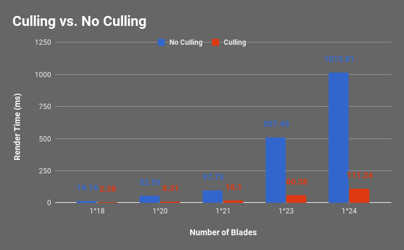
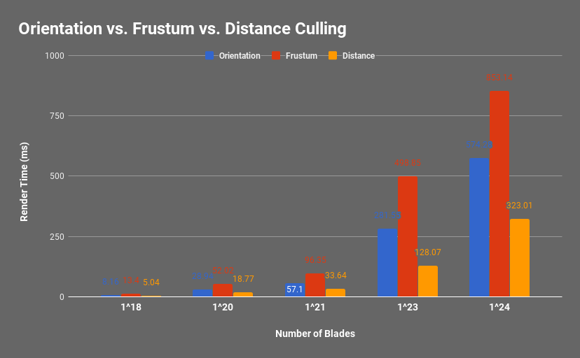

Vulkan Grass Rendering
========================

**University of Pennsylvania, CIS 565: GPU Programming and Architecture, Project 6**

* Jonathan Lee
* Tested on: Tested on: Windows 7, i7-7700 @ 4.2GHz 16GB, GTX 1070 (Personal Machine)

# Overview 

In this project, I was able to explore Vulkan by setting up a simple pipeline to render and simulate grass. This follows, [Responsive Real-Time Grass Rendering for General 3D Scenes](https://www.cg.tuwien.ac.at/research/publications/2017/JAHRMANN-2017-RRTG/JAHRMANN-2017-RRTG-draft.pdf) very closely.

## Compute Shader
The compute shader handles the physics for each grass blade and also determines if the grass blade should be culled. 

The three forces that affect a grass blade are recovery, gravity, and wind. The recovery force is to help guide the blade back to its original pose. Gravity is divided into two parts, environmental and frontal. Environmental is traditional gravitaty and frontal requires computing which way the blade is facing. Wind is an interesting force. I implemented a simple cosine function to simulate the back and forth wind.

The displacement computed from these forces are added to the `v2` component of the blade. `v1` and `v2` are then validated to ensure correct positioning. 

Once the physics is done, the shader determines whether or not the blade should be culled. There are three culling tests, orientation culling, frustum culling, and distance culling. 

# Performance Analysis

I omitted the data for (1^13) and (1^15) blades since they were fairly similar in these charts.

The time that it takes to render a single frame spikes after (1^20) grass blades. Even though there are more calculations during the compute shader to test for whether or not a blade should be culled is extremely important. 

The data above compares the individual culling tests done in the compute shader. What's interesting about this is that orientation and distance culling had lower render times, meaning they contribute most to the faster renders. Having just frustum culling took a lot longer to render. This may be because we're still packing in a lot more blades than we should even though they're in the view space. 

# Resources
* [Responsive Real-Time Grass Grass Rendering for General 3D Scenes](https://www.cg.tuwien.ac.at/research/publications/2017/JAHRMANN-2017-RRTG/JAHRMANN-2017-RRTG-draft.pdf)
* [CIS565 Vulkan samples](https://github.com/CIS565-Fall-2017/Vulkan-Samples)
* [Official Vulkan documentation](https://www.khronos.org/registry/vulkan/)
* [Vulkan tutorial](https://vulkan-tutorial.com/)
* [RenderDoc blog on Vulkan](https://renderdoc.org/vulkan-in-30-minutes.html)
* [Tessellation tutorial](http://in2gpu.com/2014/07/12/tessellation-tutorial-opengl-4-3/)
* [More Tessellation](http://prideout.net/blog/?p=48#levels)

