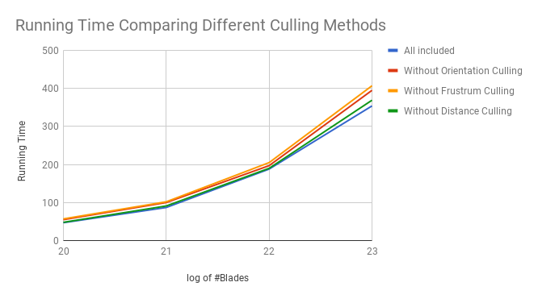

Vulkan Grass Rendering
======================

**University of Pennsylvania, CIS 565: GPU Programming and Architecture, Project 5**

* Jiahao Liu
* Tested on: **Google Chrome 61.0.3163.100(64 bits)** on
  Windows 10, i7-3920XM CPU @ 2.90GHz 3.10 GHz 16GB, GTX 980m SLI 8192MB (personal computer)

### Demo Video/GIF

Project Introduction
======================

This project uses Vulkan to implement a grass simulator and renderer. Compute shaders are used 
to perform physics calculations on Bezier curves that represent individual grass blades in the application. 
Grass blades that don't contribute to a given frame is culled.

The remaining blades will be passed to a graphics pipeline, in which involves several shaders.
A vertex shader to transform Bezier control points,a tessellation shaders to dynamically create
the grass geometry from the Bezier curves, and a fragment shader to shade the grass blades are included.

Features Introduction
======================

### Grass Rendering

Refer to the following Paper:

* [Responsive Real-Time Grass Grass Rendering for General 3D Scenes](https://www.cg.tuwien.ac.at/research/publications/2017/JAHRMANN-2017-RRTG/JAHRMANN-2017-RRTG-draft.pdf)

#### Gravity

Given a gravity direction, `D.xyz`, and the magnitude of acceleration, `D.w`, we can compute the environmental gravity in
our scene as `gE = normalize(D.xyz) * D.w`.

We then determine the contribution of the gravity with respect to the front facing direction of the blade, `f`, 
as a term called the "front gravity". Front gravity is computed as `gF = (1/4) * ||gE|| * f`.

We can then determine the total gravity on the grass blade as `g = gE + gF`.

#### Recovery

Recovery corresponds to the counter-force that brings our grass blade back into equilibrium. This is derived in the paper using Hooke's law.
In order to determine the recovery force, we need to compare the current position of `v2` to its original position before
simulation started, `iv2`. At the beginning of our simulation, `v1` and `v2` are initialized to be a distance of the blade height along the `up` vector.

Once we have `iv2`, we can compute the recovery forces as `r = (iv2 - v2) * stiffness`.

#### Wind

In order to simulate wind, you are at liberty to create any wind function you want! In order to have something interesting,
you can make the function depend on the position of `v0` and a function that changes with time. Consider using some combination
of sine or cosine functions.

Your wind function will determine a wind direction that is affecting the blade, but it is also worth noting that wind has a larger impact on
grass blades whose forward directions are parallel to the wind direction. The paper describes this as a "wind alignment" term. We won't go 
over the exact math here, but use the paper as a reference when implementing this. It does a great job of explaining this!

Once you have a wind direction and a wind alignment term, your total wind force (`w`) will be `windDirection * windAlignment`.

In order to make everything looks good, a time related force is added to this part.

#### Orientation culling

Consider the scenario in which the front face direction of the grass blade is perpendicular to the view vector. Since our grass blades
won't have width, we will end up trying to render parts of the grass that are actually smaller than the size of a pixel. This could
lead to aliasing artifacts.

In order to remedy this, we can cull these blades! Simply do a dot product test to see if the view vector and front face direction of
the blade are perpendicular. The paper uses a threshold value of `0.9` to cull, but feel free to use what you think looks best.

#### View-frustum culling

We also want to cull blades that are outside of the view-frustum, considering they won't show up in the frame anyway. To determine if
a grass blade is in the view-frustum, we want to compare the visibility of three points: `v0, v2, and m`, where `m = (1/4)v0 * (1/2)v1 * (1/4)v2`.
Notice that we aren't using `v1` for the visibility test. This is because the `v1` is a Bezier guide that doesn't represent a position on the grass blade.
We instead use `m` to approximate the midpoint of our Bezier curve.

If all three points are outside of the view-frustum, we will cull the grass blade. The paper uses a tolerance value for this test so that we are culling
blades a little more conservatively. This can help with cases in which the Bezier curve is technically not visible, but we might be able to see the blade
if we consider its width.

#### Distance culling

Similarly to orientation culling, we can end up with grass blades that at large distances are smaller than the size of a pixel. This could lead to additional
artifacts in our renders. In this case, we can cull grass blades as a function of their distance from the camera.

Performance Analysis
======================

###	Different running time for different culling methods

The time is measured using the average time for computation included (Still computation whether should we use culling) and computation not included(Codes related commented.).

Running time for each culling does not influence too much on the running time, but a clear optimization still works. Frustrum culling has the best effect,
Orientation culling follows and distance culling has the worst effect. Considering the actual range of simulation, the distance culling will not work very well on
small area of simulation. But if we are simulating a grass land, this optimization should have a very good effect.

### Credits

* [Responsive Real-Time Grass Grass Rendering for General 3D Scenes](https://www.cg.tuwien.ac.at/research/publications/2017/JAHRMANN-2017-RRTG/JAHRMANN-2017-RRTG-draft.pdf)
* [CIS565 Vulkan samples](https://github.com/CIS565-Fall-2017/Vulkan-Samples)
* [Official Vulkan documentation](https://www.khronos.org/registry/vulkan/)
* [Vulkan tutorial](https://vulkan-tutorial.com/)
* [RenderDoc blog on Vulkan](https://renderdoc.org/vulkan-in-30-minutes.html)
* [Tessellation tutorial](http://in2gpu.com/2014/07/12/tessellation-tutorial-opengl-4-3/)
