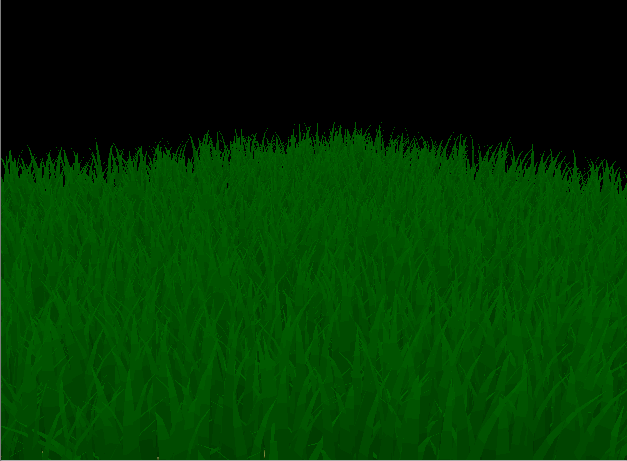
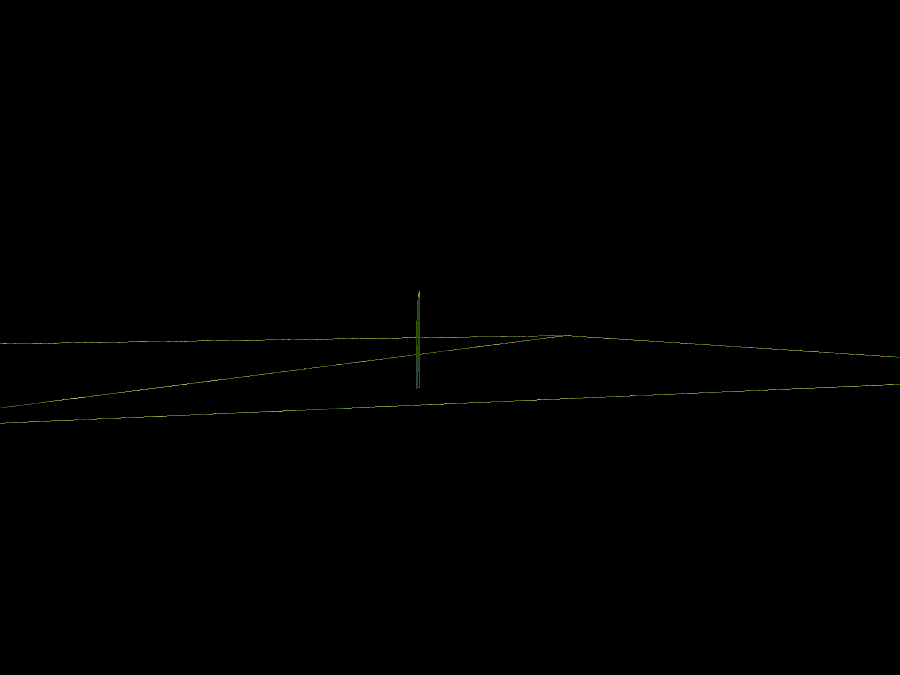
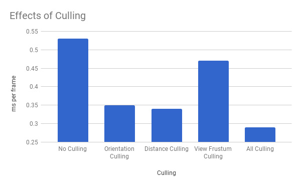

Vulkan Grass Rendering
========================

`Rishabh Shah`

`Tested on: Windows 10, i7-6700HQ @ 2.6GHz 16GB, GTX 960M 4096MB (Laptop)`

*The scene was rendered in 1000x725 resolution with 216 grass blades (before culling optimizations). The number on top left shows the FPS count.*

## Overview

In this project, I implemented a grass simulator and renderer in Vulkan. The grass blades are represented as Bezier curves, and tessellated in tessellation shaders. The wind, gravity and recovery forces are simulated using a compute shader. Grass blades are culled in three different ways, which is explored in the following sections. The bezier control points are transformed in a vertex shader, tesselated in tesselation shaders, and shaded in fragment a shader.

This project is an implementation of the paper, [Responsive Real-Time Grass Rendering for General 3D Scenes](https://www.cg.tuwien.ac.at/research/publications/2017/JAHRMANN-2017-RRTG/JAHRMANN-2017-RRTG-draft.pdf).

## Code Tour

#### Code Contents

* `src/` C++/Vulkan source files
  * `shaders/` glsl shader source files
  * `images/` images used as textures within graphics pipelines
* `external/` Includes and static libraries for 3rd party libraries
* `img/` Screenshots and images

#### Important Files

* `src/main.cpp` is the entry point of our application.
* `src/Instance.cpp` sets up the application state, initializes the Vulkan library, and contains functions that will create our
physical and logical device handles.
* `src/Device.cpp` manages the logical device and sets up the queues that our command buffers will be submitted to.
* `src/Renderer.cpp` contains most of the rendering implementation, including Vulkan setup and resource creation.
* `src/Camera.cpp` manages the camera state.
* `src/Model.cpp` manages the state of the model that grass will be created on. Currently a plane is hardcoded.
* `src/Blades.cpp` creates the control points corresponding to the grass blades. There are many parameters that you can play with
here that will change the behavior of your rendered grass blades.
* `src/Scene.cpp` manages the scene state, including the model, blades, and simualtion time.
* `src/BufferUtils.cpp` provides helper functions for creating buffers to be used as descriptors.

## Grass Rendering

### Representing Grass as Bezier Curves

Each Bezier curve has three control points.
* `v0`: the position of the grass blade on the geomtry
* `v1`: a Bezier curve guide
* `v2`: a physical guide which we simulate forces on

### Simulating Forces

We first apply transformations to `v2` and then update `v1` to maintain the appropriate length of our grass blade.

##### Gravity

Given a gravity direction, `D.xyz`, and the magnitude of acceleration, `D.w`, we can compute the environmental gravity in our scene as `gE = normalize(D.xyz) * D.w`. We then determine the contribution of the gravity with respect to the front facing direction of the blade, `f`, as a term called the "front gravity". Front gravity is computed as `gF = (1/4) * ||gE|| * f`. We can then determine the total gravity on the grass blade as `g = gE + gF`.

##### Recovery

Recovery corresponds to the counter-force that brings our grass blade back into equilibrium. This is derived in the paper using Hooke's law. In order to determine the recovery force, we need to compare the current position of `v2` to its original position before simulation started, `iv2`. At the beginning of our simulation, `v1` and `v2` are initialized to be a distance of the blade height along the `up` vector.

Once we have `iv2`, we can compute the recovery forces as `r = (iv2 - v2) * stiffness`.

##### Wind

In order to simulate wind, I have used a combination of multiple sine and cosine waves.

##### Total force

We can then determine a translation for `v2` based on the forces as `tv2 = (gravity + recovery + wind) * deltaTime`. However, we can't simply apply this translation and expect the simulation to be robust. We apply correction to ensure that the blades don't go below the ground level.

### Culling Tests

Although we need to simulate forces on every grass blade at every frame, there are many blades that we won't need to render due to a variety of reasons.

##### Orientation culling

Consider the scenario in which the front face direction of the grass blade is perpendicular to the view vector. Since our grass blades won't have width, we will end up trying to render parts of the grass that are actually smaller than the size of a pixel. This could lead to aliasing artifacts. These blades are culled using a simple dot product to check its orientation relative to the camera's look vector.

*The gif below shows the blades that will be culled. Notice the blades in the distance that are causing aliasing.*

##### View-frustum culling

We also want to cull blades that are outside of the view-frustum, considering they won't show up in the frame anyway.

*The gif below shows an exaggerated view-frustum culling.*

##### Distance culling

Similarly to orientation culling, we can end up with grass blades that at large distances are smaller than the size of a pixel. This could lead to additional artifacts in our renders. In this case, we can cull grass blades as a function of their distance from the camera. The probability of a blade to get drawn decreases with increasing distance.

*The gif below shows the result of distance culling.*

### Distance based tessellation of Bezier curves

The grass blades are tesselated as quads with details based on distance. The blades farther away have less tesselation than those close to the camera. This [tutorial on tessellation ](http://in2gpu.com/2014/07/12/tessellation-tutorial-opengl-4-3/) was referenced for understanding tesselation shaders.

*The gif below shows the result of tesselation based on distance to get high details closer to the camera, and low-poly blades far away.*

### Performance evaluation

| Blades (2^) | All optimizations | Cull - view frustum | Cull - distance | Cull - orientation |
| ----- | ----- | ----- | ----- | ----- |
|13     |    846|  	719 |	644 |	820 |
|16     |283    |	199	|180    |	270 |
|19     |52     |	32	|31	    |48     |
|22     |7      |	5   |	5   |	7   |

It is worth noting that orientation culling wasn't implemented for performance gain, but to reduce the aliasing artefact. The other two techniques give a significant boost.

Also, for tesselation based on distance, my implementation adds detail (up to 10 divisions in vertically and 4 divisions horizontally) to the base configuration (4 divisions in vertically and 2 divisions horizontally). So, the performance will decrease just a little bit when there are a large number of blades close to the camera, but the visual quality is significantly increased.

## References

The following resources were useful for this project.

* [Responsive Real-Time Grass Grass Rendering for General 3D Scenes](https://www.cg.tuwien.ac.at/research/publications/2017/JAHRMANN-2017-RRTG/JAHRMANN-2017-RRTG-draft.pdf)
* [CIS565 Vulkan samples](https://github.com/CIS565-Fall-2017/Vulkan-Samples)
* [Official Vulkan documentation](https://www.khronos.org/registry/vulkan/)
* [Vulkan tutorial](https://vulkan-tutorial.com/)
* [RenderDoc blog on Vulkan](https://renderdoc.org/vulkan-in-30-minutes.html)
* [Tessellation tutorial](http://in2gpu.com/2014/07/12/tessellation-tutorial-opengl-4-3/)
