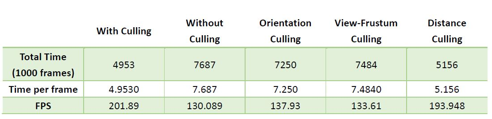
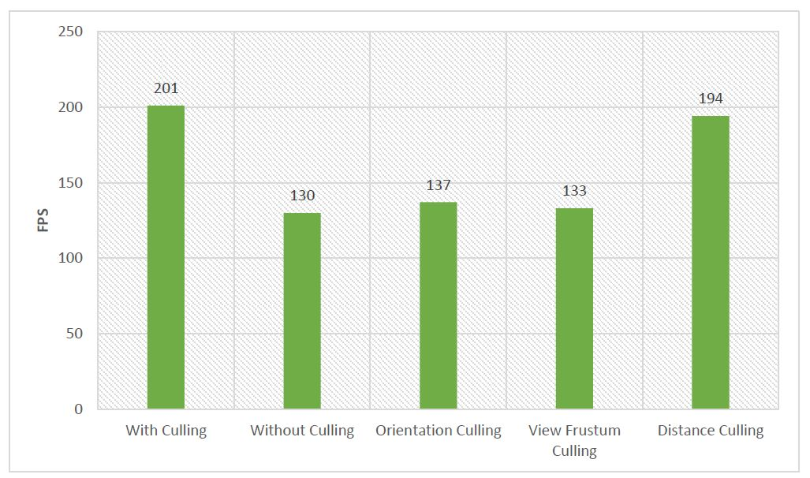

Instructions - Vulkan Grass Rendering
========================

* Jiawei Wang
* Tested on: **Google Chrome 62.0.3202.75 (Official Build) (64-bit)** on
  Windows 10, i7-6700 @ 2.60GHz 16.0GB, GTX 970M 3072MB (Personal)


## Overview
Implemented a grass simulator and renderer using Vulkan, based on paper [Responsive Real-Time Grass Rendering for General 3D Scenes](https://www.cg.tuwien.ac.at/research/publications/2017/JAHRMANN-2017-RRTG/JAHRMANN-2017-RRTG-draft.pdf)
* Used compute shaders to perform physics calculations on Bezier curves that represent individual grass blades in application. 
* Also used compute shaders to cull grass blades that don't contribute to a given frame.
* Wrote a vertex shader to transform Bezier control points, tessellation shaders to dynamically create the grass geometry from the Bezier curves, and a fragment shader to shade the grass blades.

| **Final Result** |
|---|
||

___
## Features
### Representing Grass as Bezier Curves

In this project, grass blades will be represented as Bezier curves while performing physics calculations and culling operations. 
Each Bezier curve has three control points.
* `v0`: the position of the grass blade on the geomtry
* `v1`: a Bezier curve guide that is always "above" `v0` with respect to the grass blade's up vector (explained soon)
* `v2`: a physical guide for which we simulate forces on

We also need to store per-blade characteristics that will help us simulate and tessellate our grass blades correctly.
* `up`: the blade's up vector, which corresponds to the normal of the geometry that the grass blade resides on at `v0`
* Orientation: the orientation of the grass blade's face
* Height: the height of the grass blade
* Width: the width of the grass blade's face
* Stiffness coefficient: the stiffness of our grass blade, which will affect the force computations on our blade

We can pack all this data into four `vec4`s, such that `v0.w` holds orientation, `v1.w` holds height, `v2.w` holds width, and 
`up.w` holds the stiffness coefficient.


### Compute Shader
Compute Shader in Vulkan is the same as in OpenGL, it's similar to CUDA parrellel programming. It is a **Shader Stage** that is used entirely for computing arbitrary information. While it can do rendering, it is generally used for tasks not directly related to drawing triangles and pixels.<br/>
Here I used it to do 2 things as following:
* **Force Calculation**:
  * ***Gravity***:  Given a gravity direction, `D.xyz`, and the magnitude of acceleration, `D.w`, we can compute the environmental gravity in our scene as `gE = normalize(D.xyz) * D.w`. We then determine the contribution of the gravity with respect to the front facing direction of the blade, `f`, as a term called the "front gravity". Front gravity is computed as `gF = (1/4) * ||gE|| * f`. We can then determine the total gravity on the grass blade as `g = gE + gF`.
  * ***Recovery Force***: Recovery corresponds to the counter-force that brings our grass blade back into equilibrium. This is derived in the paper using Hooke's law. In order to determine the recovery force, we need to compare the current position of `v2` to its original position before simulation started, `iv2`. At the beginning of our simulation, `v1` and `v2` are initialized to be a distance of the blade height along the `up` vector. Once we have `iv2`, we can compute the recovery forces as `r = (iv2 - v2) * stiffness`.
  * ***Wind***: a wind direction that is affecting the blade, but it is also worth noting that wind has a larger impact on grass blades whose forward directions are parallel to the wind direction. The paper describes this as a "wind alignment" term.
    * According to the paper, I used following method to simulate the wind force
    ```glsl
    //Wind
    vec3 wind_dir = normalize(vec3(0.5, 0, 1));
    float wind_speed = 8.0;
    float wave_division_width = 5.0;

    float wave_info = (cos((dot(vec3(this_v0.x, 0, this_v0.z), wind_dir) - wind_speed * totalTime) / wave_division_width) + 0.7);

//5.1 Wind
    //directional alignment 
    float fd = 1 - abs(dot(wind_dir, normalize(this_v2 - this_v0)));

    //height ratio
    float fr = dot((this_v2 - this_v0), this_up) / this_h;

    //
	float wind_power = 15.0f;
    vec3 w = wind_dir * wind_power * wave_info * fd * fr;

    ```
* **Blades Culling**: I implemented three culling conditions as following:
  * ***Orientation Culling***: Consider the scenario in which the front face direction of the grass blade is perpendicular to the view vector. Since our grass blades won't have width, we will end up trying to render parts of the grass that are actually smaller than the size of a pixel. This could lead to aliasing artifacts. In order to remedy this, we can cull these blades! Simply do a dot product test to see if the view vector and front face direction of the blade are perpendicular.
  * ***View Frustum Culling***: We also want to cull blades that are outside of the view-frustum, considering they won't show up in the frame anyway. To determine if a grass blade is in the view-frustum, we want to compare the visibility of three points: `v0, v2, and m`, where `m = (1/4)v0 * (1/2)v1 * (1/4)v2`. Notice that we aren't using `v1` for the visibility test. This is because the `v1` is a Bezier guide that doesn't represent a position on the grass blade. We instead use `m` to approximate the midpoint of our Bezier curve. If all three points are outside of the view-frustum, we will cull the grass blade. Not as the paper provides, I transformed the point into **NDC coorditnates** and then check if they are inside of the frustum.
  * ***Distance Culling***: Similarly to orientation culling, we can end up with grass blades that at large distances are smaller than the size of a pixel. This could lead to additional artifacts in our renders. In this case, we can cull grass blades as a function of their distance from the camera. Here I used the same method the paper presents as following: (Divide the blades into different buckets according to the horizontal distance, and then cull different number of the bladess according to the division)
  ```glsl
  //Distance Culling
	bool distance_culled = false;
	float min_distance = 0.1;
	float far_distance = 100;

	//seperate into 10 buckets
	//the distance between each bucket is 10
	vec4 view_v0 = camera.view * vec4(this_v0, 1.0f);
	float horizontal_distance = abs(dot(view_v0.xyz, vec3(0,0,1)));

	if(horizontal_distance > far_distance){
		distance_culled = true;
	}
	else{
		int bucket_level = int(horizontal_distance) / 10;
		if(bucket_level > 0){
			if(index % bucket_level < int(bucket_level * (1.0 - horizontal_distance/far_distance))){
				distance_culled = true;
			}
		}
	}
  ```
  
| **Distance Culling(`far_clip = 50`, 10 buckets)** |
|---|
||


### Tessellation Shader
I won't explain too much about how the tessellation shader works, but I will present how tessellation works on some different shapes mentioned in the paper. Here are the code in *tessellation evaluation shader*:
```glsl
// quad
	//float t = u;
	
	// triangle
	//float t = u + 0.5 * v - u * v;
	
	// quadratic
	//float t = u - u * v * v;

	// triangle-tip
	// border threshold between quad and triangle
	float threshold = 0.35;
	float t = 0.5 + (u - 0.5) * (1 - max(v - threshold, 0)/(1 - threshold));
```
There is also a method mentioned in the paper that can generate **Dandelion** shape, which is calculated by a complex equation that uses trigonometric functions.

___
## Performance Analysis
Most of the realization is very routine, although Vulkan is extremely hard to use. So, I only did the comparison of the different culling methods.

| **Before Culling** | **After Culling** |
|---|---|
|||

| **Comparison Between different Culling** | 
|---|
||

| **Comparison Between different Culling(FPS)** | 
|---|
||

* According to the results, we can find that in this example, the one before culling will have more artifacts than the one after culling, this is because without ***orientation culling***, some pixels on grass will smaller than the size of a pixel and it will lead to some unexpected artifacts.
* Besides, the results show that all of the culling will enhance the performance of the simulator, and the ***distance culling*** is the most remarkable method here. And one reason that the ***view frustum culling*** doesn't affect too much is that only a few blades in this example are outside of the frustum.
