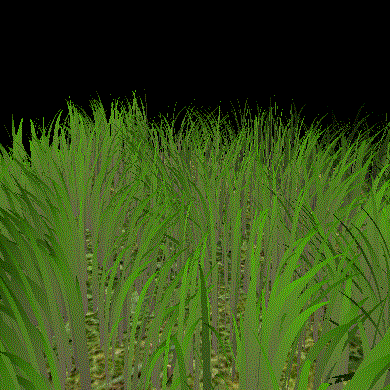
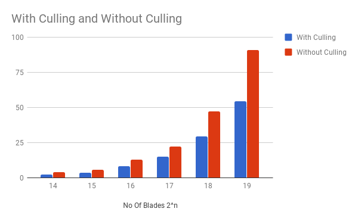
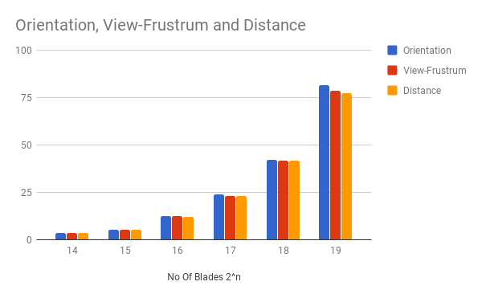
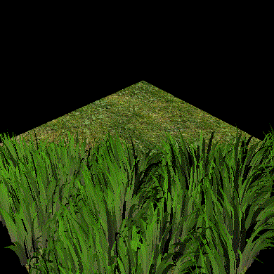

Vulkan Grass Rendering
========================

__Rudraksha Shah__

Windows 10, i7-7700HQ @ 2.80GHz 16GB, GTX 1050 4096MB (Personal Computer)

**Overview:**

In this project I implemented a grass renderer using Vulkan.

In a normal setting like games the grass on the terrain is not usually modelled and rendered along with other geometry in real time as that would be time and resource intensive hence the grass is rendered using either texture plates that do not go well with dynamic lighting conditions in a scene and also do not look good at close distances.

In this project I have implemented a way to render multiple grass blades using bazier curves representing the spine of each grass blade and using tessellation shaders render the body a multiple level of detail based on distane from the viewer. The computations of forces like wind, gravity are applied to each grass blade on the compute shader and performance optimizations like orientation culling, depth culling are applied to furthure speed up the renderer.

This implementation shows a method of dynamic rendering of grass blades for physically accurate renderig of grass on any type of terrain. 

Project Features:

- Vulkan Compute Shader.

- Vulkan Graphics Pipeline: 
  - Vertex vertex shader.
  - Tesselation Controll Shader (TCS).
  - Tesselation Evaluatioon Shader (TES).
  - Fragment shader.

- Optimizations:
  - Orientation culling.
  - Distance culling.
  - Frustum based culling.

- Force Simulation:
  - Wind.
  - Recovery.
  - Gravity.

- Distance based LOD grass rendering.

Performance Analysis
=====================

## Varying number of grass blades

- As we can see in this chart as the number of grass blades increases the performance optimizations really shine. The frame rates keep on getting better. As the number of grass blades increases the shading stage becommes more and more intensive as we are rendering each grass blade individually and by culling some of the grass blades from the get go in the vertex shader we do not spend time unneseccarily shading fragments that do not contribute to the final quality of the render. Kind of like what a deffered shader does.

## With different performance optimizations

 

- With the individual performance optimizations the difference in performance gain is very minomial to give a proper verdict on the most optimal method. The contribution of speed up gained as discussed in the above performance analysis is due to equal parts all the three optimizations.

Grass Rendering
================

## Depth Culling:

- The grass blades that are farther away from the camera will be occuluded by the grass blades in front and thus we can avoid rendering them. This will help us render less blades effectively providing us with a performance boost

## Orientation Culling

- Among the grass blades that are visible to us not all the grass blades are facing us. There will be certain grass blades that will be facing away from us and we could only see its faint edge. We can also remove them from the simulation as it will not just help us reduce the amount of blades that we need to render but also help us improve the overall look of the final render. As those blades that are only visible along the edge cause aliasing issues that create artifaces which can be completely avoided. 

## Resources

### Links

The following resources may be useful for this project.

* [Responsive Real-Time Grass Grass Rendering for General 3D Scenes](https://www.cg.tuwien.ac.at/research/publications/2017/JAHRMANN-2017-RRTG/JAHRMANN-2017-RRTG-draft.pdf)
* [CIS565 Vulkan samples](https://github.com/CIS565-Fall-2017/Vulkan-Samples)
* [Official Vulkan documentation](https://www.khronos.org/registry/vulkan/)
* [Vulkan tutorial](https://vulkan-tutorial.com/)
* [RenderDoc blog on Vulkan](https://renderdoc.org/vulkan-in-30-minutes.html)
* [Tessellation tutorial](http://in2gpu.com/2014/07/12/tessellation-tutorial-opengl-4-3/)

