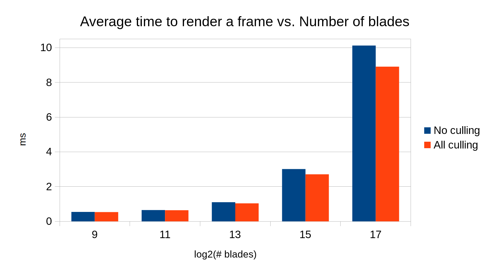
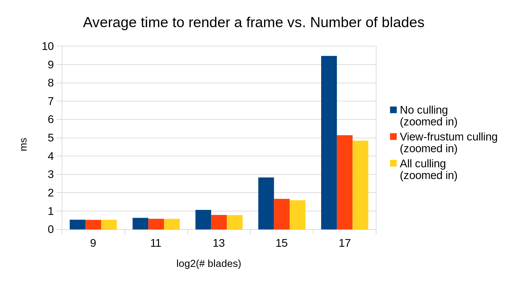

Grass Rendering with Vulkan
===============


**University of Pennsylvania, CIS 565: GPU Programming and Architecture, Project 6**

* Mauricio Mutai
* Tested on: Windows 10, i7-7700HQ @ 2.2280GHz 16GB, GTX 1050Ti 4GB (Personal Computer)

## Overview

### Introduction

One of the aims of this project was to implement a simple program that renders a large number (thousands) of natural-looking grass blades. These blades should react to external forces, such as gravity and wind, as well as internal forces to maintain its structure in a sensible way.

This grass renderer is heavily based on the work presented in [Responsive Real-Time Grass Rendering for General 3D Scenes](https://www.cg.tuwien.ac.at/research/publications/2017/JAHRMANN-2017-RRTG/JAHRMANN-2017-RRTG-draft.pdf) by Jahrmann and Wimmer. 

In summary, each grass blade is represented by three points, `v0`, `v1`, and `v2`, which themselves define a quadratic Bezier curve. One of these points, `v0`, is fixed and represents position of the blade's root. `v2` represents the position of the blade's tip. `v1` is an auxiliary point used for defining the Bezier curve. In order to render one frame, we apply certain forces (wind, gravity, and recovery) to `v2` to determine its new position. We validate `v2` to make sure it does not go under ground, and then adjust `v1` to make sure the grass blade has approximately constant length.

Having `v0`, `v1`, and `v2`, we can then use a tessellation shader to draw a 2D shape that follows the Bezier curve defined by those points. This 2D shape is our final grass blade.

In addition, we perform some culling in order to avoid drawing blades that will not contribute significantly to the final image. Three culling methods were implemented -- see more below.

The second (and perhaps more important) aim of this project was to get myself acquaintanced with the Vulkan API. As I completed the project, I made use of many pages of the Khronos documentation for Vulkan (for example, this page about [`vkCmdDrawIndirect()`](https://www.khronos.org/registry/vulkan/specs/1.0/man/html/vkCmdDrawIndirect.html)).

### Features

Below are the renderer's main features:

* Compute shader (`shaders/compute.comp`)
  * Updates blades by applying forces (wind, gravity, recovery)
  * Multiple wind forces available, selected via `#define`
  * Orientation culling
  * View-frustum culling
  * Distance culling
  * Wind direction can be used to determine blade's final color
* Grass pipeline stages
  * Vertex shader (`shaders/grass.vert`)
    * Computes positions modified by model matrix
    * Computes bitangent vector (direction along blade's width)
  * Tessellation control shader (`shaders/grass.tesc`)
    * Dynamically tessellates blades to varying levels of detail depending on distance from camera
  * Tessellation evaluation shader (`shaders/grass.tese`)
    * Evaluates Bezier curve to place blade's vertices in correct positions
  * Fragment shader (`shaders/grass.frag`)
    * Two coloring modes, depending on which one was chosen in compute shader
      * Wind as color (no shading)
        * This maps the absolute coordinates of the wind force's direction to a color. Note this uses the final wind force (scaled by the wind alignment factor), hence why a mostly vertical wind will show up as grey.
      * Lambert shading, with blades having constant green albedo color

Below are some of the main changes made to the base code (mostly related to Vulkan):

* `Renderer.cpp`
  * `Renderer::CreateComputeDescriptorSetLayout()`
    * Define descriptor set layout for compute shader
      * One buffer for storing all blades
      * One buffer for storing only blades to be rendered
      * One buffer for keeping track of how many blades should be rendered
  * `Renderer::CreateComputeDescriptorSets()`
    * Update descriptor sets for compute shader using layout above and buffers created in `Blades` objects 
  * `Renderer::CreateComputePipeline()`
    * Define one push constant (for storing total number of blades) to pass to compute shader
  * `Renderer::RecordComputeCommandBuffer()`
    * Update push constant for compute shader
  * `Renderer::Frame()`
    * Optionally print number of blades rendered in frame by copying a `VkBuffer` back into CPU memory. Enable with `#define PRINT_NUM_BLADES 1` in `Renderer.cpp`
* `Blades.h`/`Blades.cpp`
  * Define additional field `color`
    * `color.w` determines whether to use `color.xyz` or default green color to render grass blade

### Wind Functions

The wind functions are named after the macro that enables them in `shaders/compute.comp`. Some of these are shown in "Example GIFs" below.

* `WIND_X`: Periodic wind in the X direction.
* `WIND_Y`: Periodic wind mostly in the Y direction. A wind exactly in the Y direction will not move the blades due to the way `v2` is computed._
* `WIND_Z`: Periodic wind in the Z direction.
* `WIND_RADIAL`: Periodic wind that emanates outwards from the origin, creating circular waves.
* `WIND_CIRCLE`: Wind that moves around in a circular trajectory.
* `WIND_XZ`: Periodic wind in the X and Z directions. More complex than just a combination of `WIND_X` and `WIND_Z`!
* `WIND_CONST`: Constant wind in the (1, 1, -1) direction.
* `WIND_TEXT`: Periodic wind that draws mysterious text.

## Example GIFs

Below are some GIFs showcasing the wind functions implemented here, as well as the two coloring modes. These were rendered with `2^15` blades and using the camera enabled by `WIND_GIF_CAMERA` in `Camera.cpp`.

| `WIND_X`, Lambert mode     | `WIND_X`, "wind as color" mode |
|:---------------------------:|:-------------------------------:|
|  |         |

| `WIND_RADIAL`, Lambert mode     | `WIND_RADIAL`, "wind as color" mode |
|:--------------------------------:|:------------------------------------:|
|  |         |

| `WIND_CIRCLE`, Lambert mode     | `WIND_CIRCLE`, "wind as color" mode |
|:--------------------------------:|:------------------------------------:|
|  |         |

| `WIND_XZ`, Lambert mode     | `WIND_XZ`, "wind as color" mode |
|:----------------------------:|:--------------------------------:|
|  |         |

| `WIND_TEXT`, Lambert mode     | `WIND_TEXT`, "wind as color" mode |
|:------------------------------:|:----------------------------------:|
|  |         |

## Analysis

### Methodology

In order to measure the performance of this renderer, I re-purposed the `Scene::UpdateTime()` function to compute the average time spent to render one frame over 2000 frames.

Most of the measurements were taken by rendering the scene with the default camera position and orientation. For some view-frustum related tests, a special camera closer to the origin was used (see `FRUSTUM_CULL_TEST` in `Camera.cpp`). Unless this zoomed-in camera is mentioned, a test was performed using the default camera.

The analyses below generally compare the average time to render a frame as the number of blades increases and as certain optimizations are enabled or disabled.

### Orientation Culling

#### Overview

When orientation culling is enabled, the compute shader uses the blade's front vector (the direction in which the blade is "facing") and the camera's look vector (the direction in which the camera is looking) in order to determine whether the blade is roughly perpendicular with respect to the camera. Since the blade is two-dimensional, a perpendicular blade will be barely visible, so we may as well cull it and prevent further stages in the pipeline from processing it.

#### Performance Impact

Below is a graph comparing the average time to render a frame with and without orientation culling enabled. 

Note the X-axis is logarithmic (there is a 4x increase in the number of blades for each step in X) for this and all subsequent graphs.


As we can see, orientation culling has a very minimal effect at first, but the improvement in performance becomes noticeable as we increase the number of blades. 

This is probably because relatively few of the blades are actually perpendicular enough to the camera to be culled, so not many of them culled. However, all blades need to be checked as part of the test, which slows the compute shader ever so slightly.

As the number of blades increases, it's likely that the benefit of culling away a small portion of the blades becomes more evident, since our GPU is initially more saturated due to the higher number of blades.

### Distance Culling

#### Overview

When distance culling is enabled, the compute shader determines the distance from the blade's `v0` point to the camera's eye. Depending on this distance, the blade is put into one of 8 buckets. In the 1st bucket, no blades are culled. For the 2nd bucket, 1 out of 8 blades are culled. For the 3rd, 2 out of 8 are culled, and so on.

#### Performance Impact

Below is a graph comparing the average time to render a frame with and without distance culling enabled.


Like orientation culling, distance-based culling has a minimal effect at first, but makes for a more visible improvement in performance as the number of blades increases. If we compare this graph to the orientation culling one, we can see distance culling is slightly more effective. 

Just like orientation culling, with the default camera, not many blades get culled because of their distance from the camera. However, when our GPU is saturated with hundreds of thousands of blades, culling the portion of blades that are far away enough provides noticeable improvements.

### View-frustum Culling

#### Overview

When view-frustum culling is enabled, the compute shader uses the camera's view-projection matrix to project three positions on the blade to determine if none of these points are visible to the camera -- if this is the case, the blade may be culled. Note that there is some tolerance added to this check, because a blade has width, and so may be visible even if those points are not in the frustum.

The three points are `v0`, `m`, and `v2`, where `m = 0.25 * v0 + 0.5 * v1 + 0.25 * v2` is used because it actually lies on the blade's Bezier curve, unlike `v1`.

#### Performance Impact (default camera)

Below is a graph comparing the average time to render a frame with and without view-frustum culling enabled, with the default camera. 


We can see view-frustum culling has a very minimal impact. This is because, with the default camera, very few (if any) blades are actually outside the view-frustum.

It might be more interesting to investigate what happens if we move the camera such that most blades are outside the view-frustum. This is what we do in the next section.

#### Performance Impact (zoomed-in camera)

Below is a graph comparing the average time to render a frame with and without view-frustum culling enabled, with the zoomed-in camera enabled by `FRUSTUM_CULL_TEST` in `Camera.cpp`. 


In this exaggerated case, view-frustum culling provides a huge improvement to the render time -- performance is almost doubled for `2^15` and `2^17` blades.

Although most blades are culled away, we still need to run most of the compute shader for all blades, and we still need to rasterize and draw the fragments generated by the non-culled blades, which take up most of the screen. This explains why the render time drops, but not exactly in proportion to how many blades were culled away.

### Dynamic Tessellation (Level of Detail)

#### Overview

In addition to general distance-based culling in the compute shader, dynamic tessellation was implemented to adjust the level of detail in the tessellation of the blades depending on their distance from the camera.

The basic idea is that a distant blade will look small enough that the viewer will not be able to distinguish between a detailed blade (say, tessellated with 4 vertical segments) and a simple quad. Thus, we could save a bit of time by tessellating distant blades with less detail and reduce the load on the tessellation evaluation shader and subsequent pipeline stages.

#### Performance Impact

Below is a graph comparing the average time to render a frame with and without dynamic tessellation enabled. Distance culling was also enabled for these tests. This was done to better estimate the improvements gained from dynamic tessellation -- the blades that are tessellated with less detail are also likely to be culled away by the compute shader, so tests done without distance-based culling could overestimate the improvements gained from this optimization.


As we can see, dynamic tessellation provides a small improvement to performance. Even at a high number of blades, the decrease in runtime is quite small. This suggests the bulk of the work is not done in the tessellation evaluation shader and subsequent stages.

### All Culling Combined

#### Overview

Below, we investigate the effects of enabling all our culling methods.

#### Performance Impact (default camera)

Below is a graph comparing the average time to render a frame with all culling methods enabled and disabled, with the default camera. 



The improvements from the combined culling are, as before, more noticeable when there are more grass blades. Combining all culling methods leads to better performance than when any individual culling method is enabled by itself.

We know view-frustum culling is highly dependent on the camera's position and orientation, so let us investigate the results using the zoomed-in camera.

#### Performance Impact (zoomed-in camera)

Below is a graph comparing the average time to render a frame with all culling methods enabled and disabled, as well as with only distance culling enabled, with the zoomed-in camera. 



Although the distance-based culling is responsible for most of improvement in runtime, the other culling methods also help to further reduce the render time.

## Other Notes

* The GIF at the beginning of the README was rendered with `2^14` blades, "wind as color" mode enabled, and with radial wind enabled. 

* There are several `#define`s in `shaders/compute.comp` to toggle certain features:
```
#define WIND_X 0
#define WIND_Y 1
#define WIND_Z 2
#define WIND_RADIAL 3
#define WIND_CIRCLE 4
#define WIND_XZ 5
#define WIND_CONST 6
#define WIND_TEXT 7

// WIND_TYPE defines which wind function will be used.
// It should be one of the values defined immediately above._
#define WIND_TYPE WIND_XZ

// Defines the radius of the circle moving around in the circular trajectory
// in WIND_CIRCLE.
#define WIND_CIRCLE_RADIUS 5.0

// If 0, uses Lambert shading and default green albedo.
// Otherwise, uses wind as color.
#define USE_CUSTOM_COLOR 1

// Enable each culling method.
#define ORIENTATION_CULL 1
#define FRUSTUM_CULL 1
#define DISTANCE_CULL 1
```
 
