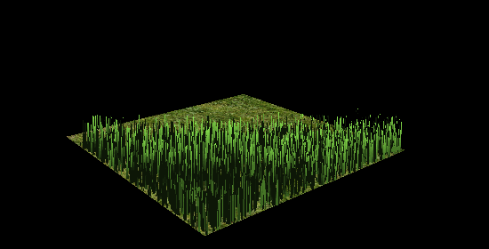
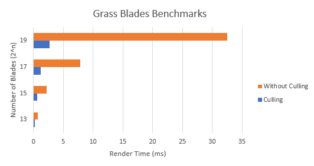
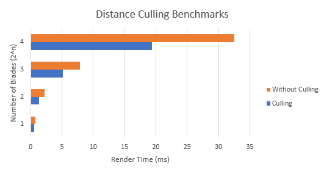
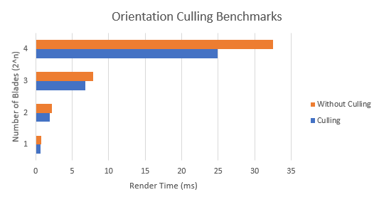
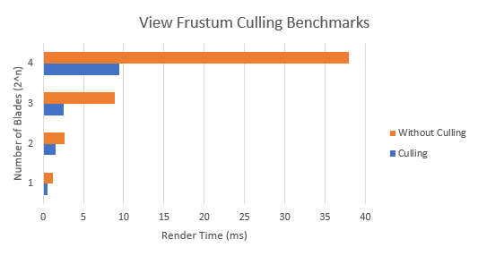

University of Pennsylvania, CIS 565: GPU Programming and Architecture, Project 6 Vulkan Grass Rendering
========================

* Ziyu Li
* Tested on: Windows 7, Intel Core i7-3840QM @2.80GHz 16GB, Nvidia Quadro K4000M 4GB

## Features
#### All Features
 - Basic Grass Render
 - Gravity Force, Recovery Force, Wind Force
 - Orientation Culling, View Frustum Culling, Distance Culling

#### Summary
In this project, you will use Vulkan to implement a grass simulator and renderer. You will use compute shaders to perform physics calculations on Bezier curves that represent individual grass blades in your application. Since rendering every grass blade on every frame will is fairly inefficient, you will also use compute shaders to cull grass blades that don't contribute to a given frame. The remaining blades will be passed to a graphics pipeline, in which you will write several shaders. You will write a vertex shader to transform Bezier control points, tessellation shaders to dynamically create the grass geometry from the Bezier curves, and a fragment shader to shade the grass blades.

## Demo
#### Basic Grass Render

#### Distance Culling

## Performance Analysis
#### Benchmark

