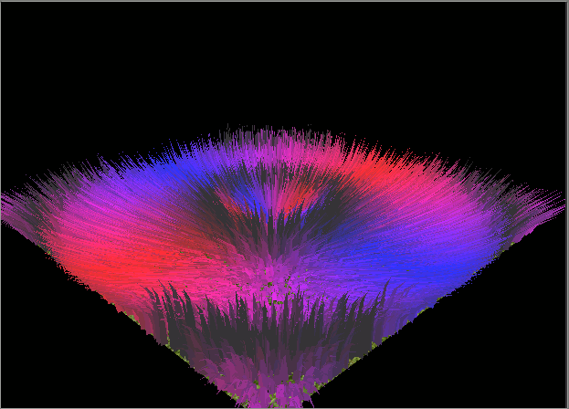
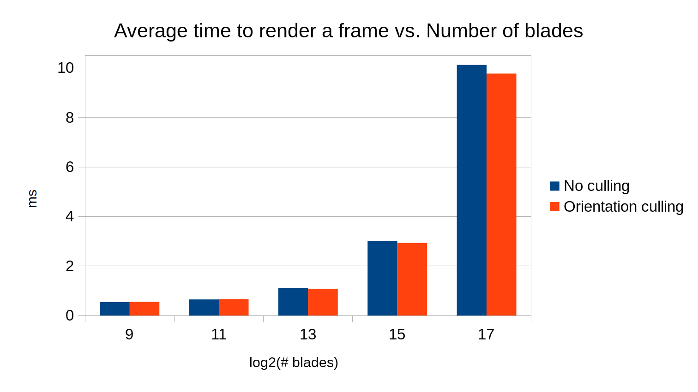
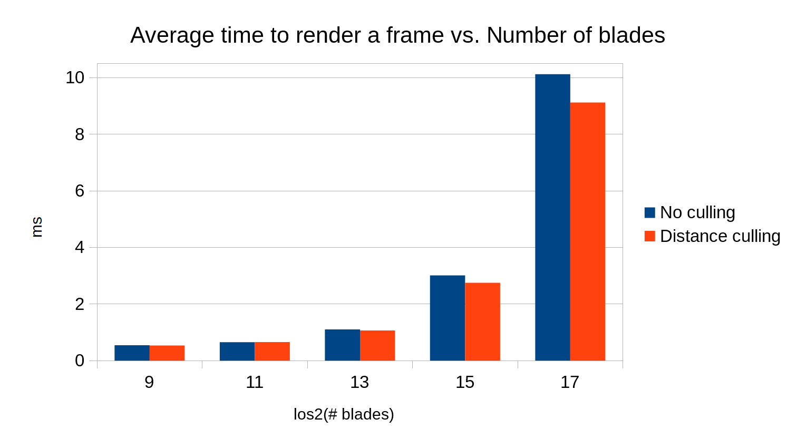
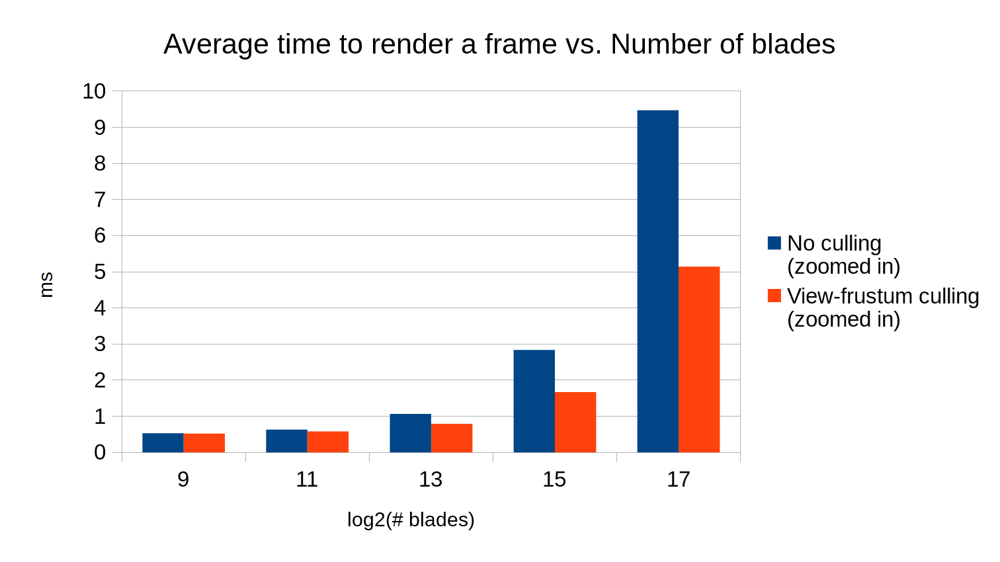
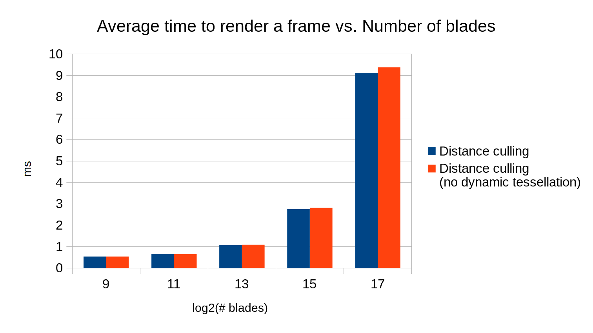

Grass Rendering with Vulkan
===============



**University of Pennsylvania, CIS 565: GPU Programming and Architecture, Project 6**

* Mauricio Mutai
* Tested on: Windows 10, i7-7700HQ @ 2.2280GHz 16GB, GTX 1050Ti 4GB (Personal Computer)

## Overview

### Introduction

One of the aims of this project was to implement a simple program that renders a large number (thousands) of natural-looking grass blades. These blades should react to external forces, such as gravity and wind, as well as internal forces to maintain its structure in a sensible way.

This grass renderer is heavily based on the work presented in [Responsive Real-Time Grass Rendering for General 3D Scenes](https://www.cg.tuwien.ac.at/research/publications/2017/JAHRMANN-2017-RRTG/JAHRMANN-2017-RRTG-draft.pdf) by Jahrmann and Wimmer. 

In summary, each grass blade is represented by three points, `v0`, `v1`, and `v2`, which themselves define a quadratic Bezier curve. One of these points, `v0`, is fixed and represents position of the blade's root. `v2` represents the position of the blade's tip. `v1` is an auxiliary point used for defining the Bezier curve. In order to render one frame, we apply certain forces (wind, gravity, and recovery) to `v2` to determine its new position. We validate `v2` to make sure it does not go under ground, and then adjust `v1` to make sure the grass blade has approximately constant length.

Having `v0`, `v1`, and `v2`, we can then use a tessellation shader to draw a 2D shape that follows the Bezier curve defined by those points. This 2D shape is our final grass blade.

In addition, we perform some culling in order to avoid drawing blades that will not contribute significantly to the final image. Three culling methods were implemented -- see more below.

The second (and perhaps more important) aim of this project was to get myself acquaintanced with the Vulkan API. As I completed the project, I made use of many pages of the Khronos documentation for Vulkan (for example, this page about [`vkCmdDrawIndirect()`](https://www.khronos.org/registry/vulkan/specs/1.0/man/html/vkCmdDrawIndirect.html)).

### Features

Below are the renderer's main features:

* Compute shader (`shaders/compute.comp`)
  * Updates blades by applying forces (wind, gravity, recovery)
  * Multiple wind forces available, selected via `#define`
  * Orientation culling
  * View-frustum culling
  * Distance culling
  * Wind direction can be used to determine blade's final color
* Grass pipeline stages
  * Vertex shader (`shaders/grass.vert`)
    * Computes positions modified by model matrix
    * Computes bitangent vector (direction along blade's width)
  * Tessellation control shader (`shaders/grass.tesc`)
    * Dynamically tessellates blades to varying levels of detail depending on distance from camera
  * Tessellation evaluation shader (`shaders/grass.tese`)
    * Evaluates Bezier curve to place blade's vertices in correct positions
  * Fragment shader (`shaders/grass.frag`)
    * Two coloring modes, depending on which one was chosen in compute shader
      * Wind as color (no shading)
        * This maps the absolute coordinates of the wind force's direction to a color. Note this uses the final wind force (scaled by the wind alignment factor), hence why a mostly vertical wind will show up as grey.
      * Lambert shading, with blades having constant green albedo color

Below are some of the main changes made to the base code (mostly related to Vulkan):

* `Renderer.cpp`
  * `Renderer::CreateComputeDescriptorSetLayout()`
    * Define descriptor set layout for compute shader
      * One buffer for storing all blades
      * One buffer for storing only blades to be rendered
      * One buffer for keeping track of how many blades should be rendered
  * `Renderer::CreateComputeDescriptorSets()`
    * Update descriptor sets for compute shader using layout above and buffers created in `Blades` objects 
  * `Renderer::CreateComputePipeline()`
    * Define one push constant (for storing total number of blades) to pass to compute shader
  * `Renderer::RecordComputeCommandBuffer()`
    * Update push constant for compute shader
  * `Renderer::Frame()`
    * Optionally print number of blades rendered in frame by copying a `VkBuffer` back into CPU memory
* `Blades.h`/`Blades.cpp`
  * Define additional field `color`
    * `color.w` determines whether to use `color.xyz` or default green color to render grass blade

### Wind Functions

The wind functions are named after the macro that enables them in `shaders/compute.comp`. Some of these are shown in "Example GIFs" below.

* `WIND_X`: Periodic wind in the X direction.
* `WIND_Y`: Periodic wind mostly in the Y direction. A wind exactly in the Y direction will not move the blades due to the way `v2` is computed._
* `WIND_Z`: Periodic wind in the Z direction.
* `WIND_RADIAL`: Periodic wind that emanates outwards from the origin, creating circular waves.
* `WIND_CIRCLE`: Wind that moves around in a circular trajectory.
* `WIND_XZ`: Periodic wind in the X and Z directions. More complex than just a combination of `WIND_X` and `WIND_Z`!
* `WIND_CONST`: Constant wind in the (1, 1, -1) direction.
* `WIND_TEXT`: Periodic wind that draws mysterious text.

## Example GIFs

Below are some GIFs showcasing the wind functions implemented here, as well as the two coloring modes. These were rendered using the camera enabled by `WIND_GIF_CAMERA` in `Camera.cpp`.

| `WIND_X`, Lambert mode     | `WIND_X`, "wind as color" mode |
|:---------------------------:|:-------------------------------:|
|  |         |

| `WIND_RADIAL`, Lambert mode     | `WIND_RADIAL`, "wind as color" mode |
|:--------------------------------:|:------------------------------------:|
|  |         |

| `WIND_CIRCLE`, Lambert mode     | `WIND_CIRCLE`, "wind as color" mode |
|:--------------------------------:|:------------------------------------:|
|  |         |

| `WIND_XZ`, Lambert mode     | `WIND_XZ`, "wind as color" mode |
|:----------------------------:|:--------------------------------:|
|  |         |

| `WIND_TEXT`, Lambert mode     | `WIND_TEXT`, "wind as color" mode |
|:------------------------------:|:----------------------------------:|
|  |         |

## Analysis

### Methodology

In order to measure the performance of this renderer, I re-purposed the `Scene::UpdateTime()` function to compute the average time spent to render one frame over 2000 frames.

Most of the measurements were taken by rendering the scene with the default camera position and orientation. For some view-frustum related tests, a special camera closer to the origin was used (see `FRUSTUM_CULL_TEST` in `Camera.cpp`). Unless this zoomed-in camera is mentioned, a test was performed using the default camera.

The analyses below generally compare the average time to render a frame as the number of blades increases and as certain optimizations are enabled or disabled.

### Orientation Culling

#### Overview

When orientation culling is enabled, the compute shader uses the blade's front vector (the direction in which the blade is "facing") and the camera's look vector (the direction in which the camera is looking) in order to determine whether the blade is roughly perpendicular with respect to the camera. Since the blade is two-dimensional, a perpendicular blade will be barely visible, so we may as well cull it and prevent further stages in the pipeline from processing it.

#### Performance Impact

Below is a graph comparing the average time to render a frame with and without orientation culling enabled. 

Note the X-axis is logarithmic (there is a 4x increase in the number of blades for each step in X) for this and all subsequent graphs.



As we can see, orientation culling has a very minimal effect at first, but the improvement in performance becomes noticeable as we increase the number of blades. 

This is probably because relatively few of the blades are actually perpendicular enough to the camera to be culled, so not many of them culled. However, all blades need to be checked as part of the test, which slows the compute shader ever so slightly.

As the number of blades increases, it's likely that the benefit of culling away a small portion of the blades becomes more evident, since our GPU is initially more saturated due to the higher number of blades.

### Distance Culling

#### Overview

When distance culling is enabled, the compute shader determines the distance from the blade's `v0` point to the camera's eye. Depending on this distance, the blade is put into one of 8 buckets. In the 1st bucket, no blades are culled. For the 2nd bucket, 1 out of 8 blades are culled. For the 3rd, 2 out of 8 are culled, and so on.

#### Performance Impact

Below is a graph comparing the average time to render a frame with and without distance culling enabled.



Like orientation culling, distance-based culling has a minimal effect at first, but makes for a more visible improvement in performance as the number of blades increases. If we compare this graph to the orientation culling one, we can see distance culling is slightly more effective. 

Just like orientation culling, with the default camera, not many blades get culled because of their distance from the camera. However, when our GPU is saturated with hundreds of thousands of blades, culling the portion of blades that are far away enough provides noticeable improvements.

### View-frustum Culling

#### Overview

When view-frustum culling is enabled, the compute shader uses the camera's view-projection matrix to project three positions on the blade to determine if none of these points are visible to the camera -- if this is the case, the blade may be culled. Note that there is some tolerance added to this check, because a blade has width, and so may be visible even if those points are not in the frustum.

The three points are `v0`, `m`, and `v2`, where `m = 0.25 * v0 + 0.5 * v1 + 0.25 * v2` is used because it actually lies on the blade's Bezier curve, unlike `v1`.

#### Performance Impact (default camera)

Below is a graph comparing the average time to render a frame with and without view-frustum culling enabled, with the default camera. 


We can see view-frustum culling has a very minimal impact. This is because, with the default camera, very few (if any) blades are actually outside the view-frustum.

It might be more interesting to investigate what happens if we move the camera such that most blades are outside the view-frustum. This is what we do in the next section.

#### Performance Impact (zoomed-in camera)

Below is a graph comparing the average time to render a frame with and without view-frustum culling enabled, with the zoomed-in camera enabled by `FRUSTUM_CULL_TEST` in `Camera.cpp`. 



In this exaggerated case, view-frustum culling provides a huge improvement to the render time -- performance is almost doubled for `2^15` and `2^17` blades.

Although most blades are culled away, we still need to run most of the compute shader for all blades, and we still need to rasterize and draw the fragments generated by the non-culled blades, which take up most of the screen. This explains why the render time drops, but not exactly in proportion to how many blades were culled away.

### Dynamic Tessellation (Level of Detail)

#### Overview

In addition to general distance-based culling in the compute shader, dynamic tessellation was implemented to adjust the level of detail in the tessellation of the blades depending on their distance from the camera.

The basic idea is that a distant blade will look small enough that the viewer will not be able to distinguish between a detailed blade (say, tessellated with 4 vertical segments) and a simple quad. Thus, we could save a bit of time by tessellating distant blades with less detail and reduce the load on the tessellation evaluation shader and subsequent pipeline stages.

#### Performance Impact

Below is a graph comparing the average time to render a frame with and without dynamic tessellation enabled. Distance culling was also enabled for these tests. This was done to better estimate the improvements gained from dynamic tessellation -- the blades that are tessellated with less detail are also likely to be culled away by the compute shader, so tests done without distance-based culling could overestimate the improvements gained from this optimization.



As we can see, dynamic tessellation provides a small improvement to performance. Even at a high number of blades, the decrease in runtime is quite small. This suggests the bulk of the work is not done in the tessellation evaluation shader and subsequent stages.

## Other Notes

* The GIF at the beginning of the README was rendered with `2^14` blades, "wind as color" mode enabled, and with radial wind enabled. 

* There are several `#define`s in `shaders/compute.comp` to toggle certain features:
```
#define WIND_X 0
#define WIND_Y 1
#define WIND_Z 2
#define WIND_RADIAL 3
#define WIND_CIRCLE 4
#define WIND_XZ 5
#define WIND_CONST 6
#define WIND_TEXT 7

// WIND_TYPE defines which wind function will be used.
// It should be one of the values defined immediately above._
#define WIND_TYPE WIND_XZ

// Defines the radius of the circle moving around in the circular trajectory
// in WIND_CIRCLE.
#define WIND_CIRCLE_RADIUS 5.0

// If 0, uses Lambert shading and default green albedo.
// Otherwise, uses wind as color.
#define USE_CUSTOM_COLOR 1

// Enable each culling method.
#define ORIENTATION_CULL 1
#define FRUSTUM_CULL 1
#define DISTANCE_CULL 1
```
 
Instructions - Vulkan Grass Rendering
========================

This is due **Sunday 11/5, evening at midnight**.

**Summary:**
In this project, you will use Vulkan to implement a grass simulator and renderer. You will
use compute shaders to perform physics calculations on Bezier curves that represent individual
grass blades in your application. Since rendering every grass blade on every frame will is fairly
inefficient, you will also use compute shaders to cull grass blades that don't contribute to a given frame.
The remaining blades will be passed to a graphics pipeline, in which you will write several shaders.
You will write a vertex shader to transform Bezier control points, tessellation shaders to dynamically create
the grass geometry from the Bezier curves, and a fragment shader to shade the grass blades.

The base code provided includes all of the basic Vulkan setup, including a compute pipeline that will run your compute
shaders and two graphics pipelines, one for rendering the geometry that grass will be placed on and the other for 
rendering the grass itself. Your job will be to write the shaders for the grass graphics pipeline and the compute pipeline, 
as well as binding any resources (descriptors) you may need to accomplish the tasks described in this assignment.


You are not required to use this base code if you don't want
to. You may also change any part of the base code as you please.
**This is YOUR project.** The above .gif is just a simple example that you
can use as a reference to compare to.

**Important:**
- If you are not in CGGT/DMD, you may replace this project with a GPU compute
project. You MUST get this pre-approved by Austin Eng before continuing!

### Contents

* `src/` C++/Vulkan source files.
  * `shaders/` glsl shader source files
  * `images/` images used as textures within graphics pipelines
* `external/` Includes and static libraries for 3rd party libraries.
* `img/` Screenshots and images to use in your READMEs

### Installing Vulkan

In order to run a Vulkan project, you first need to download and install the [Vulkan SDK](https://vulkan.lunarg.com/).
Make sure to run the downloaded installed as administrator so that the installer can set the appropriate environment
variables for you.

Once you have done this, you need to make sure your GPU driver supports Vulkan. Download and install a 
[Vulkan driver](https://developer.nvidia.com/vulkan-driver) from NVIDIA's website.

Finally, to check that Vulkan is ready for use, go to your Vulkan SDK directory (`C:/VulkanSDK/` unless otherwise specified)
and run the `cube.exe` example within the `Bin` directory. IF you see a rotating gray cube with the LunarG logo, then you
are all set!

### Running the code

While developing your grass renderer, you will want to keep validation layers enabled so that error checking is turned on. 
The project is set up such that when you are in `debug` mode, validation layers are enabled, and when you are in `release` mode,
validation layers are disabled. After building the code, you should be able to run the project without any errors. You will see 
a plane with a grass texture on it to begin with.


## Requirements

**Ask on the mailing list for any clarifications.**

In this project, you are given the following code:

* The basic setup for a Vulkan project, including the swapchain, physical device, logical device, and the pipelines described above.
* Structs for some of the uniform buffers you will be using.
* Some buffer creation utility functions.
* A simple interactive camera using the mouse. 

You need to implement the following features/pipeline stages:

* Compute shader (`shaders/compute.comp`)
* Grass pipeline stages
  * Vertex shader (`shaders/grass.vert')
  * Tessellation control shader (`shaders/grass.tesc`)
  * Tessellation evaluation shader (`shaders/grass.tese`)
  * Fragment shader (`shaders/grass.frag`)
* Binding of any extra descriptors you may need

See below for more guidance.

## Base Code Tour

Areas that you need to complete are
marked with a `TODO` comment. Functions that are useful
for reference are marked with the comment `CHECKITOUT`.

* `src/main.cpp` is the entry point of our application.
* `src/Instance.cpp` sets up the application state, initializes the Vulkan library, and contains functions that will create our
physical and logical device handles.
* `src/Device.cpp` manages the logical device and sets up the queues that our command buffers will be submitted to.
* `src/Renderer.cpp` contains most of the rendering implementation, including Vulkan setup and resource creation. You will 
likely have to make changes to this file in order to support changes to your pipelines.
* `src/Camera.cpp` manages the camera state.
* `src/Model.cpp` manages the state of the model that grass will be created on. Currently a plane is hardcoded, but feel free to 
update this with arbitrary model loading!
* `src/Blades.cpp` creates the control points corresponding to the grass blades. There are many parameters that you can play with
here that will change the behavior of your rendered grass blades.
* `src/Scene.cpp` manages the scene state, including the model, blades, and simualtion time.
* `src/BufferUtils.cpp` provides helper functions for creating buffers to be used as descriptors.

We left out descriptions for a couple files that you likely won't have to modify. Feel free to investigate them to understand their 
importance within the scope of the project.

## Grass Rendering

This project is an implementation of the paper, [Responsive Real-Time Grass Rendering for General 3D Scenes](https://www.cg.tuwien.ac.at/research/publications/2017/JAHRMANN-2017-RRTG/JAHRMANN-2017-RRTG-draft.pdf).
Please make sure to use this paper as a primary resource while implementing your grass renderers. It does a great job of explaining
the key algorithms and math you will be using. Below is a brief description of the different components in chronological order of how your renderer will
execute, but feel free to develop the components in whatever order you prefer.

### Representing Grass as Bezier Curves

In this project, grass blades will be represented as Bezier curves while performing physics calculations and culling operations. 
Each Bezier curve has three control points.
* `v0`: the position of the grass blade on the geomtry
* `v1`: a Bezier curve guide that is always "above" `v0` with respect to the grass blade's up vector (explained soon)
* `v2`: a physical guide for which we simulate forces on

We also need to store per-blade characteristics that will help us simulate and tessellate our grass blades correctly.
* `up`: the blade's up vector, which corresponds to the normal of the geometry that the grass blade resides on at `v0`
* Orientation: the orientation of the grass blade's face
* Height: the height of the grass blade
* Width: the width of the grass blade's face
* Stiffness coefficient: the stiffness of our grass blade, which will affect the force computations on our blade

We can pack all this data into four `vec4`s, such that `v0.w` holds orientation, `v1.w` holds height, `v2.w` holds width, and 
`up.w` holds the stiffness coefficient.


### Simulating Forces

In this project, you will be simulating forces on grass blades while they are still Bezier curves. This will be done in a compute
shader using the compute pipeline that has been created for you. Remember that `v2` is our physical guide, so we will be
applying transformations to `v2` initially, then correcting for potential errors. We will finally update `v1` to maintain the appropriate
length of our grass blade.

#### Binding Resources

In order to update the state of your grass blades on every frame, you will need to create a storage buffer to maintain the grass data.
You will also need to pass information about how much time has passed in the simulation and the time since the last frame. To do this,
you can extend or create descriptor sets that will be bound to the compute pipeline.

#### Gravity

Given a gravity direction, `D.xyz`, and the magnitude of acceleration, `D.w`, we can compute the environmental gravity in
our scene as `gE = normalize(D.xyz) * D.w`.

We then determine the contribution of the gravity with respect to the front facing direction of the blade, `f`, 
as a term called the "front gravity". Front gravity is computed as `gF = (1/4) * ||gE|| * f`.

We can then determine the total gravity on the grass blade as `g = gE + gF`.

#### Recovery

Recovery corresponds to the counter-force that brings our grass blade back into equilibrium. This is derived in the paper using Hooke's law.
In order to determine the recovery force, we need to compare the current position of `v2` to its original position before
simulation started, `iv2`. At the beginning of our simulation, `v1` and `v2` are initialized to be a distance of the blade height along the `up` vector.

Once we have `iv2`, we can compute the recovery forces as `r = (iv2 - v2) * stiffness`.

#### Wind

In order to simulate wind, you are at liberty to create any wind function you want! In order to have something interesting,
you can make the function depend on the position of `v0` and a function that changes with time. Consider using some combination
of sine or cosine functions.

Your wind function will determine a wind direction that is affecting the blade, but it is also worth noting that wind has a larger impact on
grass blades whose forward directions are parallel to the wind direction. The paper describes this as a "wind alignment" term. We won't go 
over the exact math here, but use the paper as a reference when implementing this. It does a great job of explaining this!

Once you have a wind direction and a wind alignment term, your total wind force (`w`) will be `windDirection * windAlignment`.

#### Total force

We can then determine a translation for `v2` based on the forces as `tv2 = (gravity + recovery + wind) * deltaTime`. However, we can't simply
apply this translation and expect the simulation to be robust. Our forces might push `v2` under the ground! Similarly, moving `v2` but leaving
`v1` in the same position will cause our grass blade to change length, which doesn't make sense.

Read section 5.2 of the paper in order to learn how to determine the corrected final positions for `v1` and `v2`. 

### Culling tests

Although we need to simulate forces on every grass blade at every frame, there are many blades that we won't need to render
due to a variety of reasons. Here are some heuristics we can use to cull blades that won't contribute positively to a given frame.

#### Orientation culling

Consider the scenario in which the front face direction of the grass blade is perpendicular to the view vector. Since our grass blades
won't have width, we will end up trying to render parts of the grass that are actually smaller than the size of a pixel. This could
lead to aliasing artifacts.

In order to remedy this, we can cull these blades! Simply do a dot product test to see if the view vector and front face direction of
the blade are perpendicular. The paper uses a threshold value of `0.9` to cull, but feel free to use what you think looks best.

#### View-frustum culling

We also want to cull blades that are outside of the view-frustum, considering they won't show up in the frame anyway. To determine if
a grass blade is in the view-frustum, we want to compare the visibility of three points: `v0, v2, and m`, where `m = (1/4)v0 * (1/2)v1 * (1/4)v2`.
Notice that we aren't using `v1` for the visibility test. This is because the `v1` is a Bezier guide that doesn't represent a position on the grass blade.
We instead use `m` to approximate the midpoint of our Bezier curve.

If all three points are outside of the view-frustum, we will cull the grass blade. The paper uses a tolerance value for this test so that we are culling
blades a little more conservatively. This can help with cases in which the Bezier curve is technically not visible, but we might be able to see the blade
if we consider its width.

#### Distance culling

Similarly to orientation culling, we can end up with grass blades that at large distances are smaller than the size of a pixel. This could lead to additional
artifacts in our renders. In this case, we can cull grass blades as a function of their distance from the camera.

You are free to define two parameters here.
* A max distance afterwhich all grass blades will be culled.
* A number of buckets to place grass blades between the camera and max distance into.

Define a function such that the grass blades in the bucket closest to the camera are kept while an increasing number of grass blades
are culled with each farther bucket.

#### Occlusion culling (extra credit)

This type of culling only makes sense if our scene has additional objects aside from the plane and the grass blades. We want to cull grass blades that
are occluded by other geometry. Think about how you can use a depth map to accomplish this!

### Tessellating Bezier curves into grass blades

In this project, you should pass in each Bezier curve as a single patch to be processed by your grass graphics pipeline. You will tessellate this patch into 
a quad with a shape of your choosing (as long as it looks sufficiently like grass of course). The paper has some examples of grass shapes you can use as inspiration.

In the tessellation control shader, specify the amount of tessellation you want to occur. Remember that you need to provide enough detail to create the curvature of a grass blade.

The generated vertices will be passed to the tessellation evaluation shader, where you will place the vertices in world space, respecting the width, height, and orientation information
of each blade. Once you have determined the world space position of each vector, make sure to set the output `gl_Position` in clip space!

** Extra Credit**: Tessellate to varying levels of detail as a function of how far the grass blade is from the camera. For example, if the blade is very far, only generate four vertices in the tessellation control shader.

To build more intuition on how tessellation works, I highly recommend playing with the [helloTessellation sample](https://github.com/CIS565-Fall-2017/Vulkan-Samples/tree/master/samples/5_helloTessellation)
and reading this [tutorial on tessellation](http://in2gpu.com/2014/07/12/tessellation-tutorial-opengl-4-3/).

## Resources

### Links

The following resources may be useful for this project.

* [Responsive Real-Time Grass Grass Rendering for General 3D Scenes](https://www.cg.tuwien.ac.at/research/publications/2017/JAHRMANN-2017-RRTG/JAHRMANN-2017-RRTG-draft.pdf)
* [CIS565 Vulkan samples](https://github.com/CIS565-Fall-2017/Vulkan-Samples)
* [Official Vulkan documentation](https://www.khronos.org/registry/vulkan/)
* [Vulkan tutorial](https://vulkan-tutorial.com/)
* [RenderDoc blog on Vulkan](https://renderdoc.org/vulkan-in-30-minutes.html)
* [Tessellation tutorial](http://in2gpu.com/2014/07/12/tessellation-tutorial-opengl-4-3/)


## Third-Party Code Policy

* Use of any third-party code must be approved by asking on our Google Group.
* If it is approved, all students are welcome to use it. Generally, we approve
  use of third-party code that is not a core part of the project. For example,
  for the path tracer, we would approve using a third-party library for loading
  models, but would not approve copying and pasting a CUDA function for doing
  refraction.
* Third-party code **MUST** be credited in README.md.
* Using third-party code without its approval, including using another
  student's code, is an academic integrity violation, and will, at minimum,
  result in you receiving an F for the semester.


## README

* A brief description of the project and the specific features you implemented.
* At least one screenshot of your project running.
* A performance analysis (described below).

### Performance Analysis

The performance analysis is where you will investigate how...
* Your renderer handles varying numbers of grass blades
* The improvement you get by culling using each of the three culling tests

## Submit

If you have modified any of the `CMakeLists.txt` files at all (aside from the
list of `SOURCE_FILES`), mentions it explicity.
Beware of any build issues discussed on the Google Group.

Open a GitHub pull request so that we can see that you have finished.
The title should be "Project 6: YOUR NAME".
The template of the comment section of your pull request is attached below, you can do some copy and paste:  

* [Repo Link](https://link-to-your-repo)
* (Briefly) Mentions features that you've completed. Especially those bells and whistles you want to highlight
    * Feature 0
    * Feature 1
    * ...
* Feedback on the project itself, if any.
