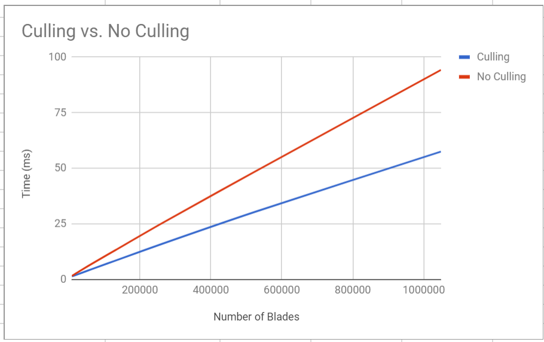

Vulkan Grass Rendering
======================

**University of Pennsylvania, CIS 565: GPU Programming and Architecture, Project 6**

* Mohamed Soudy
* Tested on: Windows 10, i7 @ 2.7 GHz 16GB, GT 650M 1024 MB

### Overview

An implementation of a grass simulator and renderer using Vulkan based on
the paper, [Responsive Real-Time Grass Rendering for General 3D Scenes](https://www.cg.tuwien.ac.at/research/publications/2017/JAHRMANN-2017-RRTG/JAHRMANN-2017-RRTG-draft.pdf).

### Performance Analysis

The renderer was faster with culling included as shown in the chart below.
The difference in performance becomes more prominent as the number of blades increase.
The effect of culling is more significant when the number of blades exceed 1 million.

When comparing the performance boost of all three culling tests on the renderer, the difference between them is negligible.
However, as we increase the number of blades we can start to identify which culling test better improves the performance of the renderer as seen in the chart below.
The distance test provides the best results, followed by the view-frustum test then finally the orientation test being 
the least significant.

