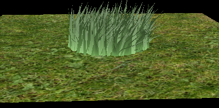

Vulkan Grass Rendering
========================

**University of Pennsylvania, CIS 565: GPU Programming and Architecture, Project 4**
* Timothy Clancy (clancyt)
* Tested on: Windows 10, i5-4590 @ 3.30GHz 8GB, GTX 970 4GB (Personal)

## Features

*A GPU-accelerated real time grass renderer implemented in Vulkan.*

|||
|:-:|:-:|
|Unculled grass in quad shape.|Unculled grass in triangle shape.|

This implementation features a full Vulkan rendering pipeline for generating a field brimming with blades of grass whose motion is realistically simulated according to gravity, blade stiffness, and wind. The implementation is drawn from the paper [Responsive Real-Time Grass Rendering for General 3D Scenes](https://www.cg.tuwien.ac.at/research/publications/2017/JAHRMANN-2017-RRTG/JAHRMANN-2017-RRTG-draft.pdf).

### Grass Shape

As shown above, the blades of grass can have their shapes changed. In addition to the "quad" and "triangle" shapes, this implementation also supports "quadratic" and "triangle-tipped" shapes for blades of grass.

|||
|:-:|:-:|
|Unculled grass in quadratic shape.|Unculled grass in triangle-tipped shape.|

The differences between the shapes can be difficult to notice, even at small scale. The technique is applicable to other types of shapes, however, should one feel like simulating more varied blades; the reference paper provides an implementation of dandelion-shaped leaves.

|||||
|:-:|:-:|:-:|:-:|
|Quad-shaped grass.|Triangle-shaped grass.|Quadratic-shaped grass.|Triangle-tipped grass.|

The triangle-tipped blades of grass can be altered by an additional parameter defining where on the blade the tip begins to narrow. This parameter, marked as "TAU" in this implementation, can range from [0, 1) and has the following effect on appearance.

||||||
|:-:|:-:|:-:|:-:|:-:|
|TAU of 0.0.|TAU of 0.1.|TAU of 0.2.|TAU of 0.3.|TAU of 0.4.|

||||||
|:-:|:-:|:-:|:-:|:-:|
|TAU of 0.5.|TAU of 0.6.|TAU of 0.7.|TAU of 0.8.|TAU of 0.9.|

Once again, the changes are very subtle. However, one can distinctly notice a broadening in the blades of grass.

### Simulated Forces

The grass in this implementation has its movement influenced by three independent forces. The first is "recovery," which is dependent on the stiffness value of an individual blade of grass. The range for controlling possible stiffness is available in "Blades.h," where the count of grass can also be altered. The recovery force dictates the tendency for a blade of grass to attempt to right itself and return to the initial upright pose, working counter to gravity and wind forces. This is what gives the grass its resultant "springiness."

The second force influencing this scene is gravity. The direction and strength of gravity can be altered via specified constants in the compute shader. In this scene, gravity attempts to drag the face of a blade of grass towards the bottom of the scene.

Lastly, the compute shader also contains logic for dictating the direction of the wind and its strength along three independent axes. For the purposes of these example clips, the wind was applied in a time-based fashion back and forth across the x-axis and with random, periodic bursts of wind along the z-axis.

### State Checking

This implementation contains logic for ensuring that the grass behaves properly; at no point in time can the part of a blade of grass be pushed through the bottom of the scene. Instead, setting something like a ridiculously powerful wind or gravity value will flatten all of the grass in the scene.

|||
|:-:|:-:|
|Grass flattened due to high gravity.|Grass flattened due to high wind.|

Notice that the grass flattened due to the high gravity is oriented in random directions according to whichever way the individual blades were facing, whereas the high-wind is pushing all blades of grass flat in the same direction.

## Optimizations

In addition to the rendering and simulation features described above, this project implements several critical performance optimizations. Each optimization has flags and threshold variables which can be specified in the compute shader to toggle on or off these individual improvements.

### Orientation Culling

Orientation culling specifies a threshold value for which blades of grass not directly aligned to some degree with the camera are culled. This performance optimization can be used to remove blades of grass which are being viewed nearly directly side-on. These blades would be so thin as to be hardly visible and can be removed without impacting the quality of the scene.

|||||
|:-:|:-:|:-:|:-:|
|Grass with orientation threshold of 0.1.|Grass with orientation threshold of 0.7.|Grass with orientation threshold of 0.8.|Grass with orientation threshold of 0.9.|

The orientation threshold specifies how close to side-on a blade needs to be before it is removed. The value of 0.1 will only remove blades which are very close to being viewed directly side-on, leaving the scene looking largely the same. As this value is increased, however, the only blades of grass remaining are those which are very close to facing the camera directly.

### Frustum Culling

The camera in a scene represents a position and view direction which provide a frustum-shaped area for rendering. There is a near-plane, behind which the user cannot see; this is essentially everything that is behind the camera. There is a far plane where the user loses visibility of objects in the scene. And there are four walls connecting the two planes which represent the perspective the user has looking into the scene.

|||
|:-:|:-:|
|A demonstration of culling with the view frustum.|A model of the data representing a blade of grass.|

This optimization looks, within some tolerance value, for blades of grass that are entirely outside of the viewing frustum. These are blades of grass that the user does not see beacause they are behind them or outside of their field of view. These blades can be culled from the scene without impacting quality at all, since the user could never see them anyways. In the example gif above, the tolerance value has been set to a negative value just as an experiment to demonstrate that blades of grass near the frustum's edge are being removed. In practice, I find that a value of 0.09 leaves quality entirely intact while giving impressive performance boosts.

### Distance Culling

The last optimization made in this implementation is that of distance culling. This optimization comes in two parts. In the compute shader there is specified a "MAX_DISTANCE" value which is a cut-off threshold representing a distance from the user's camera beyond which all blades of grass get culled from the scene. In the following examples, grass is culled from the center of the plane to demonstrate what changing the distance culling parameters does.

||||||
|:-:|:-:|:-:|:-:|:-:|
|Max distance one.|Max distance two.|Max distance three.|Max distance four.|Max distance nine.|

As the culling threshold is increased, grass is able to render further to the edges of the scene. The second portion of distance culling is the representation of the renderable portion of the scene as several "buckets." These buckets represent regions of the scene where we can group together blades of grass a similar distance from the camera. This is configurable through the "NUM_BUCKETS" variable.

||||||
|:-:|:-:|:-:|:-:|:-:|
|Two buckets.|Three buckets.|Four buckets.|Five buckets.|Fifteen buckets.|

