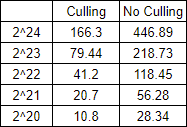

Vulkan Grass Tesselation
========================

**University of Pennsylvania, CIS 565: GPU Programming and Architecture, Project 6**

* Aman Sachan
* Tested on: Windows 10, i7-7700HQ @ 2.8GHz 32GB, GTX 1070(laptop GPU) 8074MB (Personal Machine: Customized MSI GT62VR 7RE)

## Demo Video

## OverView

This project implements a grass simulator and renderer using Vulkan. Each grass blade is represented by a quadratic Bezier curve, and physics calculations are performed on these control points in a compute shader. Since rendering every grass blade is computationally expensive, grass blade that do not contribute to a frame are culled in the computer shader. Visible bezier representaions of grass blades are sent to a grass graphics pipeline where the Bezier control points are transofmred, geometry is created in tesselations shaders, and the grass is shaded in the fragment shader.

## Features

### Coming Soon, ie Monday Night

