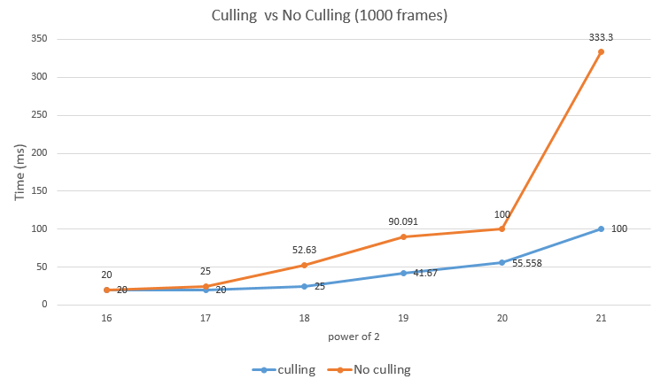
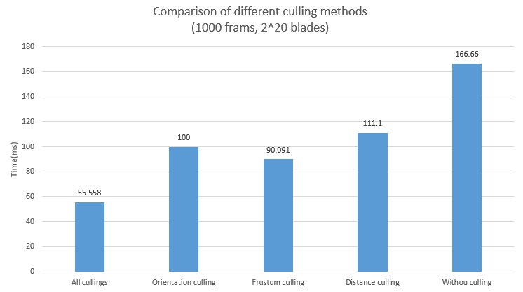

Vulkan Grass Rendering
========================

**University of Pennsylvania, CIS 565: GPU Programming and Architecture, Project 6**

* Yi Guo
* Tested on:  Windows 8.1, Intel(R) Core(TM)i5-4200M CPU @ 2.50GHz 8GB, NVIDIA GeForce 840M (Personal Notebook)

### Description
In this project, we use compute shaders to perform physics calculations on Bezier curves that represent individual grass blades in your application. Since rendering every grass blade on every frame will is fairly inefficient, we use compute shaders to cull grass blades that don't contribute to a given frame. The grass geometry is created through the Bezier curves.

### ScreenShots
* **Demo**

* **Debug**

<table class="image">
<tr>
  <td>Normal </td>
  <td>Bitangent </td>
</tr>
<tr>
  <td></td>
  <td></td>
</tr>
</table>

### Method

The implementation of the grass rendering is based on the paper,[Responsive Real-Time Grass Rendering for General 3D Scenes](https://www.cg.tuwien.ac.at/research/publications/2017/JAHRMANN-2017-RRTG/JAHRMANN-2017-RRTG-draft.pdf).Grass blades will be represented as Bezier curves while performing physics calculations and culling operations.      
Each Bezier curve has three control points.
* `v0`: the position of the grass blade on the geomtry
* `v1`: a Bezier curve guide that is always "above" `v0` with respect to the grass blade's up vector (explained soon)
* `v2`: a physical guide for which we simulate forces on

We also need to store per-blade characteristics that will help us simulate and tessellate our grass blades correctly.
* `up`: the blade's up vector, which corresponds to the normal of the geometry that the grass blade resides on at `v0`
* Orientation: the orientation of the grass blade's face
* Height: the height of the grass blade
* Width: the width of the grass blade's face
* Stiffness coefficient: the stiffness of our grass blade, which will affect the force computations on our blade

We pack all this data into four `vec4`s, such that `v0.w` holds orientation, `v1.w` holds height, `v2.w` holds width, and `up.w` holds the stiffness coefficient.

We also simulate forces and do the culling tests. Please read the paper above for more details.

### Performance Analysis

In this part, we compare different culling methods and the overall time cost for different number of blades.

* **No Culling VS Culling**

Generally speaking, as the number of blades become larger and larger, the time cost will increase gradually. To avoid rendering the grass blades that don't contribute to a given frame, we can do the culling tests in the compute shader to filter out those blades. We make a plot to show the benefit of doing culling tests.     

As the plot shows, when the number of blades is relatively small, doing culling test may not produce great influence on the overall efficiency. However, when the blade number becomes really huge, doing culling test will dramatically decrease the time cost, which proves our statement above.

* **Different Culling methods**

We also make a comparison between different culling methods(camera position fixed) and make a plot below.

As we can see, frustrum culling test produce greatest effect on the overall efficiency and the effect of distance culling is relatively small. However, in my opinion, it is not appropriate to generally say which culling method brings the greatest benefit to the overall efficiency, because they are used to deal with different cases. For example, distance culling works for huge meadowland, orientation culling works well when the camera(eye) is inside the grass and frustrum culling works for the case that camera cannot capture the whole grass land. Here since the scene we create is not huge enough, distance culling may not produce great effect. But generally speaking, the effect for frustrum culling test should be relatively obvious, because in most cases, our camera frustrum won't cover the whole grass land. 

### Credits

* [Responsive Real-Time Grass Grass Rendering for General 3D Scenes](https://www.cg.tuwien.ac.at/research/publications/2017/JAHRMANN-2017-RRTG/JAHRMANN-2017-RRTG-draft.pdf)
* [CIS565 Vulkan samples](https://github.com/CIS565-Fall-2017/Vulkan-Samples)
* [Official Vulkan documentation](https://www.khronos.org/registry/vulkan/)
* [Vulkan tutorial](https://vulkan-tutorial.com/)
* [RenderDoc blog on Vulkan](https://renderdoc.org/vulkan-in-30-minutes.html)
* [Tessellation tutorial](http://in2gpu.com/2014/07/12/tessellation-tutorial-opengl-4-3/)

