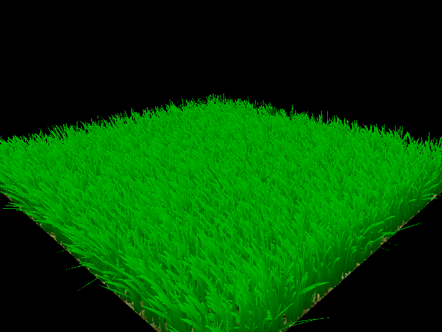

# Vulkan Grass Rendering
================

**University of Pennsylvania, CIS 565: GPU Programming and Architecture, Project 6**

* Name: William Ho
* Email: willho@seas.upenn.edu
* Tested on: Windows 10 Home, Intel(R) Core(TM) i5-6400 CPU @ 2.70GHz, 20.4GB, GeForce GT 730

# Overview

This project is an implementation of the paper [Responsive Real-Time Grass Grass Rendering for General 3D Scenes](https://www.cg.tuwien.ac.at/research/publications/2017/JAHRMANN-2017-RRTG/JAHRMANN-2017-RRTG-draft.pdf). I use compute shaders in a Vulkan compute pipeline to simulate physical forces on blades of grass, which are modeled as bezier curves composed of 3 control points. A separate graphics pipeline is used to tesselate the grass blades and rasterize them. 

### Simulating Forces

I simulate the effects of three forces on every blade of grass. Each blade of grass is given its own width, height, orientation, and stiffness coefficient within a probability distribution. These values determine how a single blade of grass will behave in relation to the following forces:

- Gravity: The force of gravity is applied to show the realistic bending of the grass blades as their weight pulls them down. It is composed of two components, an environmental gravity force, and a "front" gravity force that depends on the blades orientation.

- Recovery: The force which a blade of grass exerts on itself to try and return to its initial position.

- Wind: The directional force of wind at the location of the blade. 

The total force acting on a blade of grass is simply the sum of these 3 forces multiplied by the time change between frames. I simulate these forces for every blade in the simulation, however, there are several culling operations that can be performed that eliminate the need to render all of the blades. 

### Culling 

#### Orientation culling

#### View-frustum culling

#### Distance culling
|No Distance Culling (2^14 blades) | Distance Culling (2^15 blades) |
|:----:|:----:|
|||

##### Debug View for Distance Based Culling

### Distance Based Tessellation

|No Distance Based Tessellation (2^16 blades) | Distance Based Tesselation (2^16 blades) |
|:----:|:----:|
|||

This type of culling only makes sense if our scene has additional objects aside from the plane and the grass blades. We want to cull grass blades that
are occluded by other geometry. Think about how you can use a depth map to accomplish this!

### References

* [Responsive Real-Time Grass Grass Rendering for General 3D Scenes](https://www.cg.tuwien.ac.at/research/publications/2017/JAHRMANN-2017-RRTG/JAHRMANN-2017-RRTG-draft.pdf)
* [CIS565 Vulkan samples](https://github.com/CIS565-Fall-2017/Vulkan-Samples)
* [Official Vulkan documentation](https://www.khronos.org/registry/vulkan/)
* [Vulkan tutorial](https://vulkan-tutorial.com/)
* [RenderDoc blog on Vulkan](https://renderdoc.org/vulkan-in-30-minutes.html)
* [Tessellation tutorial](http://in2gpu.com/2014/07/12/tessellation-tutorial-opengl-4-3/)

