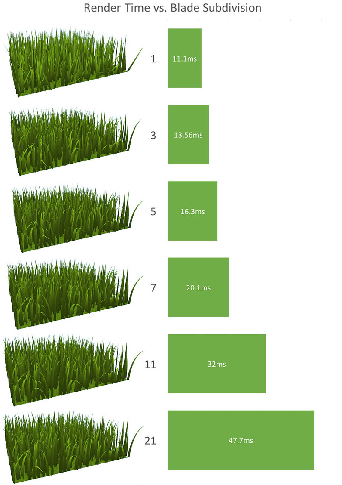

WebGL Clustered Deferred and Forward+ Shading
======================

**A realtime grass simulation making use of Vulkan's compute, tesselation, and rendering capabilities.**
**University of Pennsylvania, CIS 565: GPU Programming and Architecture, Project 6**

* Daniel Daley-Mongtomery
* Tested on: MacBook Pro, OSX 10.12, i7 @ 2.3GHz, 16GB RAM, GT 750M 2048MB (Personal Machine)

### Demo Link

### Implementation

##### 1: Creating the Vulkan Pipelines
  The word 'Vulkan' has made some waves in the graphics and gaming communities as the next major leap in realtime rendering. The API is *extremely* explicit, allowing developers to specify exactly what they require to perform every task to maximize CPU/GPU balance and utilization. In the context of this project, this meant generating the necessary information about grass blades' positions, rigidity, dimensions, and normals, as well as information about the camera and any geometry.
  
  This information is bound to customizable Vulkan device buffers and outlined in descriptor sets to specify how much information arrives to which shaders and in what format. This micromanaged paradigm was painful, but not much worse than the contrived texture packing required for [WebGL applications](https://github.com/illDivino/Project5-WebGL-Clustered-Deferred-Forward-Plus). Said and done, I tested a few starting configurations to ensure that my grass was as robust as it should be:

  After a little bit of experiementation, I settled on the below scene to use in my performance evaluations, as it seemed a representative example of how a grass simulation might be used in a real application. The scene has 219 blades with 7 vertical tesselation subdivions each.

##### 2: Compute Shader
  The physics simulation itself followed the example of [this paper](https://www.cg.tuwien.ac.at/research/publications/2017/JAHRMANN-2017-RRTG/JAHRMANN-2017-RRTG-draft.pdf) paper by Klemens Jahrmann and Michael Wimmer, which stored all information about a blade's height, width, rigidity, orientation, current bend, and normal in four 4D vectors. The curve of the grass is computed as a bezier curve between three points in space, the middle of which exists to account for length conservation. 
 

 
Every frame, the tip of the blade is affected by three forces:
* Wind, which can be generated as an arbitrary vector. I found it worked best as a function of space *and* time, as is found in the demo gif at the top of this document. Wind is also scaled according to the orientation of the blade, such that the orthoganal flat of the balde catches more wind force than the oblique edge.
* Recovery, represented as the difference between the current and original blade tip location, scaled by a rigidity constant.
* Gravity, which pulls the blade down along a gravity vector and the blade "forward."
  
  While a good and relatively inexpensive model, it would become difficult to simulate and render every single one of 221 blades according to this model every frame. To prevent doing useless work, we cull those blades which contribute least to the final image:

Distance Culling | Orientation Culling | Frustum Culling
--- | --- | ---
Those blades that are within a certain distance *d* of the camera are fully simulated (unless culled by other methods). Between *d* and *2d* only a third of blades are simulated, but all are rendered. Past *3d* no simuation takes place, and at *4d* blades are not even rendered. | Because blades have no thickness, looking at one from the oblique edge might cover less than a pixel in x space, resulting in wasted computation and possibly artifacts. Blades whose forward vector's dot product with the view direction meet a certain threshold are accordingly culled. | Frustum culling simply checks the root, middle, and tip of each blade to ensure that at least one is within the camera frustum. If each of these fall without, there is no reason to compute or render the blade.

Those blades that did pass these tests were added to an out buffer and incremented the reported number of blades that made it through. Below are the effects of culling on the test scene pictured above:

  Surprisingly, orientation culling was more effective even than frustum culling for the test scene. While orientation culling's contribution was rather static, however, frustum culling is *extremely* effective for specific situations like looking up or down. As the scene size increases, it can be reasonably assumed that distance culling's effects will increase as well. 

##### 3: Tesselation Shaders

  Tesselation shaders allow extra geometry to be generated on the fly, saving tons of memory on vertices while still allowing realtime adjustment for cheap. While somewhat niche, they work great for procedural projects like this. Here, I subdivided grass along its length in the tessellation control shader, then tapered, bent, and computed the normal for blades in the tessellation evaluation shader. 

  While we don't have to store the complex geometry between frames, each subdivision in the control shader adds executions to the evaluation and vertex stages. Below is a comparison of cost to quality in the context of my project. Times are for the test scene above, the image is just for clearer visuals.

I settled on 7 subdivisions for my scene, but depending on context, it seems like many applications could get away with 5.

##### 4: Rendering

  The grass rendering uses the normal from the tessellation evaluation shader and simple lambert shading. I also generated a rolling plane by [generating a quad from the root positions of every few blades](https://zippy.gfycat.com/InsignificantBlackandwhiteChihuahua.mp4) in each row and column, which maps a repeating grass texture the same color as the blades. Afer all is said and done, the entire system scales as follows:

### Credits

* [Responsive Real-Time Grass Grass Rendering for General 3D Scenes](https://www.cg.tuwien.ac.at/research/publications/2017/JAHRMANN-2017-RRTG/JAHRMANN-2017-RRTG-draft.pdf)
* [CIS565 Vulkan samples](https://github.com/CIS565-Fall-2017/Vulkan-Samples)
* [Official Vulkan documentation](https://www.khronos.org/registry/vulkan/)
* [Vulkan tutorial](https://vulkan-tutorial.com/)
