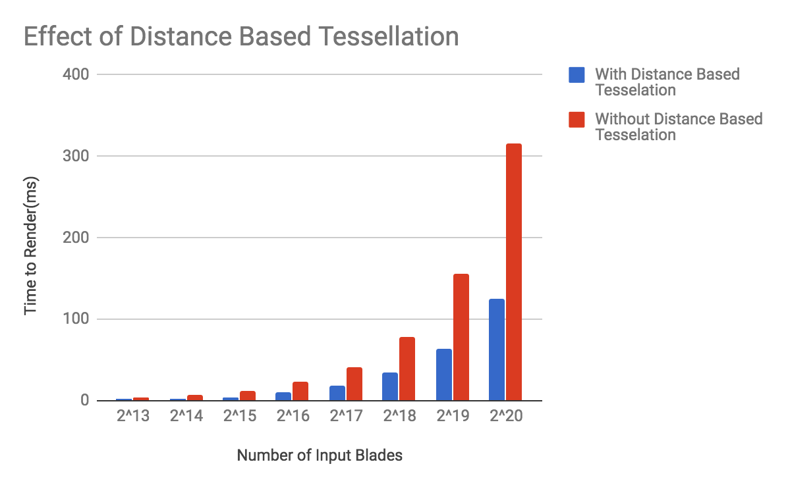

# Vulkan Grass Rendering
================

**University of Pennsylvania, CIS 565: GPU Programming and Architecture, Project 6**

* Name: William Ho
* Email: willho@seas.upenn.edu
* Tested on: Windows 10 Home, Intel(R) Core(TM) i5-6400 CPU @ 2.70GHz, 20.4GB, GeForce GT 730

# Overview

This project is an implementation of the paper [Responsive Real-Time Grass Grass Rendering for General 3D Scenes](https://www.cg.tuwien.ac.at/research/publications/2017/JAHRMANN-2017-RRTG/JAHRMANN-2017-RRTG-draft.pdf). I use compute shaders in a Vulkan compute pipeline to simulate physical forces on blades of grass, which are modeled as bezier curves composed of 3 control points. A separate graphics pipeline is used to tesselate the grass blades and rasterize them. 

### Simulating Forces

I simulate the effects of three forces on every blade of grass. Each blade of grass is given its own width, height, orientation, and stiffness coefficient within a probability distribution. These values determine how a single blade of grass will behave in relation to the following forces:

- Gravity: The force of gravity is applied to show the realistic bending of the grass blades as their weight pulls them down. It is composed of two components, an environmental gravity force, and a "front" gravity force that depends on the blades orientation.

- Recovery: The force which a blade of grass exerts on itself to try and return to its initial position.

- Wind: The directional force of wind at the location of the blade. 

The total force acting on a blade of grass is simply the sum of these 3 forces multiplied by the time change between frames. I simulate these forces for every blade in the simulation, however, there are several culling operations that can be performed that eliminate the need to render all of the blades. 

### Culling 

#### Orientation Culling

Since the blades of grass are modeled as flat 2D tessellated geometry, blades viewed at an angle perpendicular to their face normal can result in visual artifacts that lower image quality. Furthermore, as they contribute very little to the scene, these blades can be culled using a simple dot product test. From any given view, the number of such blades is relatively small, but it does grant a modest speed improvement.

#### View-frustum Culling

Of course, blades outside the camera's view frustrum need not be rendered, and those can be culled as well. My implementation is to cull based on the first control point of a given blade, which is located at the point it connects to the ground. This seems to result in the cleanest culling, as using other control points can lead to flickering at the edges. However, having some margin on each dimension of the frustrum is advisable since it is possible to accidentally cull a blade whose top should be visible. 

#### Distance Based Culling
|No Distance Culling (2^14 blades) | Distance Culling (2^15 blades) |
|:----:|:----:|
|||

Distance based culling is used to leverage the fact that we can achieve similar visual results by having a greater concentration of blades closer to the camera and fewer blades as we move away. In my implementation, blades are placed into buckets based on how far from the camera they are. At each successive bucket further from the camera, the probability of a blade being culled increases based on a pseudo random probability distribution function. The debug screenshot below illustrates this using the center of the scene in place of the camera eye. 

Some tweaking is required with this culling method. My implementation increases the "culling probability" exponentially away from the camera, but it would be worth it to explore what might be optimal. It is also important to note that we want to balance between gaining time wins and culling too many blades. In the examples above, we achieve comparable images from rendering 2^14 blades without culling and rendering 2^15 blades with my current distance based culling method. However, note that as shown by the chart below, the right side image still had a significant time win. 

### Distance Based Tessellation

|No Distance Based Tessellation (2^16 blades) | Distance Based Tesselation (2^16 blades) |
|:----:|:----:|
|||

Similarly to culling based on distance form the camera, we can leverage the fact that at farther distances from the camera, blades do not need to be modelled in as high definition. By reducing tessellation parameters based on distance, we can gain a very significant time optimization (~50%) where the visual differences are almost imperceptible. 

### References

* [Responsive Real-Time Grass Grass Rendering for General 3D Scenes](https://www.cg.tuwien.ac.at/research/publications/2017/JAHRMANN-2017-RRTG/JAHRMANN-2017-RRTG-draft.pdf)
* [CIS565 Vulkan samples](https://github.com/CIS565-Fall-2017/Vulkan-Samples)
* [Official Vulkan documentation](https://www.khronos.org/registry/vulkan/)
* [Vulkan tutorial](https://vulkan-tutorial.com/)
* [RenderDoc blog on Vulkan](https://renderdoc.org/vulkan-in-30-minutes.html)
* [Tessellation tutorial](http://in2gpu.com/2014/07/12/tessellation-tutorial-opengl-4-3/)

