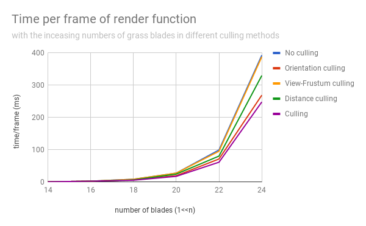

Vulkan Grass Rendering
========================

**University of Pennsylvania, CIS 565: GPU Programming and Architecture, Project 6**

* Yalun Hu
* Tested on: Windows 10, i7-6700HQ CPU @ 2.60GHz 32GB, GTX 1070 8192MB (Personal computer)

  

# Features

## 1. Compute Shader

  

* Perform physics calculations on Bezier curves that represent individual grass blades.
    * Apply gravity, wind force, recovery force to each blade.
* Cull grass blades that don't contribute to a given frame.
    * Orientation culling
    * View-frustum culling
    * Distance culling

## 2. Graphics pipeline
* Vertex shader
    * transform Bezier control points from model space to world space.
* Tessellation control shader
    * Decide tesselation level.
* Tessellation evaluation shader
    * place the vertices in world space, respecting the width, height, and orientation information of each blade. Here I used triangle as the basic shape.
* Fragment shader
    * Lambert shading with a simple point light.

# Performance Analysis

  

* Parameter:
    * Distance culling: Max depth = 50, Culling level = 10
    * View-frustum culling: tolerance = 1

It shows that culling really improves the performance, especially when the number of blades is big. For different three culling method, orientation culling has a bigger influence than other two methods, and view-frustum culling has less impact on the performance.
