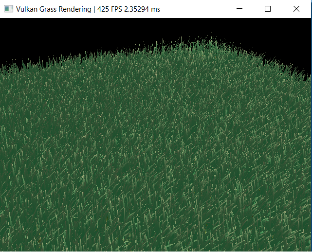
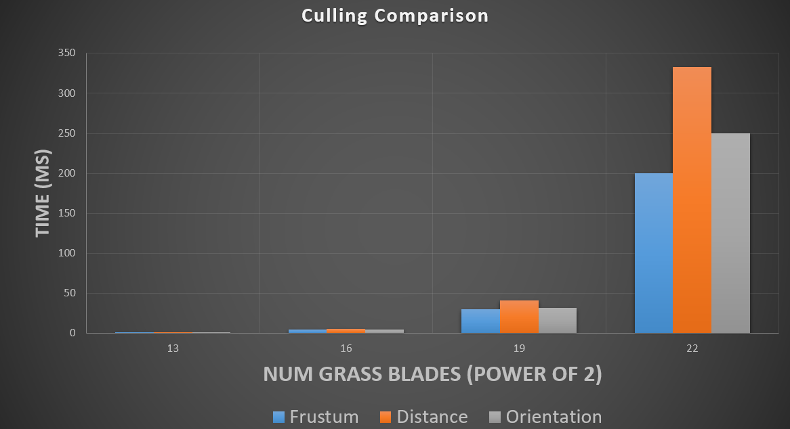

**University of Pennsylvania, CIS 565: GPU Programming and Architecture,
Project 6 - Vulkan Grass Rendering**

* Josh Lawrence
* Tested on: Windows 10, i7-6700HQ @ 2.6GHz 8GB, GTX 960M 2GB  Personal

**Overview** 
For implementation details see:
https://www.cg.tuwien.ac.at/research/publications/2017/JAHRMANN-2017-RRTG/JAHRMANN-2017-RRTG-draft.pdfs

For tesselation details see:
http://in2gpu.com/2014/07/12/tessellation-tutorial-opengl-4-3/
http://prideout.net/blog/?p=48#levels

**Highlights** 
Several culling optimizations were used to reduce computation cost: orientation culling, frustum culling and distance culling. To reduce triangle count, tesselation level is reduced the further the blade is away from the camera. Performance comparisons between culling techniques are sensitive to the setup of the scene but provide insight into how much work is being removed by these culling techniques.
 
 

**Vulkan Grass Rendering** 

**Screenshot**

**Data** 
**Performance improvement due to all culling techniques** 

**Performance comparison between culling techniques** 

**Performance comparison between tesselation falloff vs no falloff** 

**Table of data used for graph** 

**GPU Device Properties** 
https://devblogs.nvidia.com/parallelforall/5-things-you-should-know-about-new-maxwell-gpu-architecture/ 
cuda cores 640 
mem bandwidth 86.4 GB/s 
L2 cache size 2MB 
num banks in shared memory 32 
number of multiprocessor 5 
max blocks per multiprocessor 32 
total shared mem per block 49152 bytes 
total shared mem per MP 65536 bytes 
total regs per block and MP 65536 
max threads per block 1024 
max threads per mp 2048 
total const memory 65536 
max reg per thread 255 
max concurrent warps 64 
total global mem 2G 
 
max dims for block 1024 1024 64 
max dims for a grid 2,147,483,647 65536 65536 
clock rate 1,097,5000 
texture alignment 512 
concurrent copy and execution yes 
major.minor 5.0 
