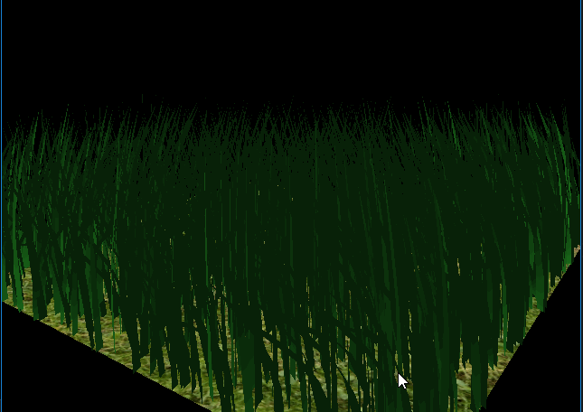
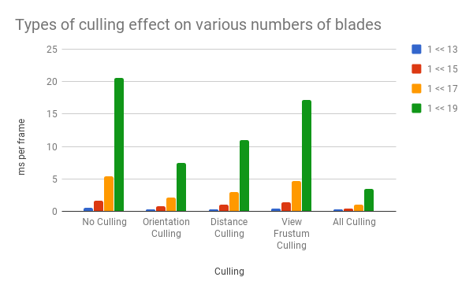
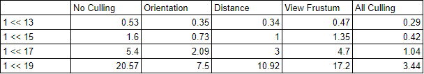

Vulkan Grass Rendering
===============

**University of Pennsylvania, CIS 565: GPU Programming and Architecture, Project 6**

* Wenli Zhao
* Tested on: Windows 10 Pro, Intel Xeon CPU CPU E5-1630 v4 @ 3.70GHz 32GB, NVIDIA GeForce GTX 24465MB (Sig Lab)

### README

## Grass Rendering

This project is an implementation of the paper, [Responsive Real-Time Grass Rendering for General 3D Scenes](https://www.cg.tuwien.ac.at/research/publications/2017/JAHRMANN-2017-RRTG/JAHRMANN-2017-RRTG-draft.pdf).

### Representing Grass as Bezier Curves

In this project, grass blades are represented as Bezier curves in order to perform physics calculations and culling operations. 
Each Bezier curve has three control points.
* `v0`: the position of the grass blade on the geomtry
* `v1`: a Bezier curve guide that is always "above" `v0` with respect to the grass blade's up vector (explained soon)
* `v2`: a physical guide for which we simulate forces on

Per-blade characterstics are stored to help simulate the physics and tesselate the grass blades.
* `up`: the blade's up vector, which corresponds to the normal of the geometry that the grass blade resides on at `v0`
* Orientation: the orientation of the grass blade's face
* Height: the height of the grass blade
* Width: the width of the grass blade's face
* Stiffness coefficient: the stiffness of our grass blade, which will affect the force computations on our blade

The data is packed into four `vec4`s, such that `v0.w` holds orientation, `v1.w` holds height, `v2.w` holds width, and 
`up.w` holds the stiffness coefficient.

### Simulating Forces

Gravity, wind and restorative forces are simulated on the Bezier curves in order to represent movement in the grass. For each of the forces, we calculate a change in the position of the control point, v2, of the bezier curve. We also adjust v1 in order to maintain a constant length for the grass blade.

### Culling tests

#### Orientation culling

Consider the scenario in which the front face direction of the grass blade is perpendicular to the view vector. Since our grass blades
won't have width, we end up trying to render parts of the grass that are actually smaller than the size of a pixel. This could
lead to aliasing artifacts.

In order to remedy this, we cull these blades! We check a dot product test to see if the view vector and front face direction of
the blade are perpendicular.

#### View-frustum culling

If the control points v0 and v2 and the midpoint of the bezier curve are all in the camera's view-frustrum, we draw the blade. If not, we cull the blade.

#### Distance culling

If the grass is too far, it gets culled. The case below represents a simple distance test.

### Tessellating Bezier curves into grass blades

Using a tesselation shader, each bezier curve is transformed into a triangular blade. The tessellation control shader specifies how to compute new vertex values and subdivides an input based on some input variables. The results are passed to the tesselation evaluation shader and can be determined with UVs. For this project, each grass blade was passed to the control shader, which tessellated a quad in order to create the shape of the grass. In the evaluation shader, the blade's shape was determined.

### Performance Analysis

In order to test the effects of culling, I measured the frame rate for each type of culling separately, as well as all the types of culling together and compared it to no culling. For distance culling, I set the distance threshold to be 10 in order to have a consistent distance of blades not drawn. View frustum culling did not help the frame rate too much because the view of the camera I chose for the scene did not exclude too many blades. It also seems like orientation culling was a much better stand-alone optimization.

The relative performance gain of each type of culling was consistent amongst different number of blades. Compounded, all types of culling was an enormous optimization. All forms of culling impact the seen very differently based on the position of the camera. In order to be more thorough about testing, I could also test out different scenes.

