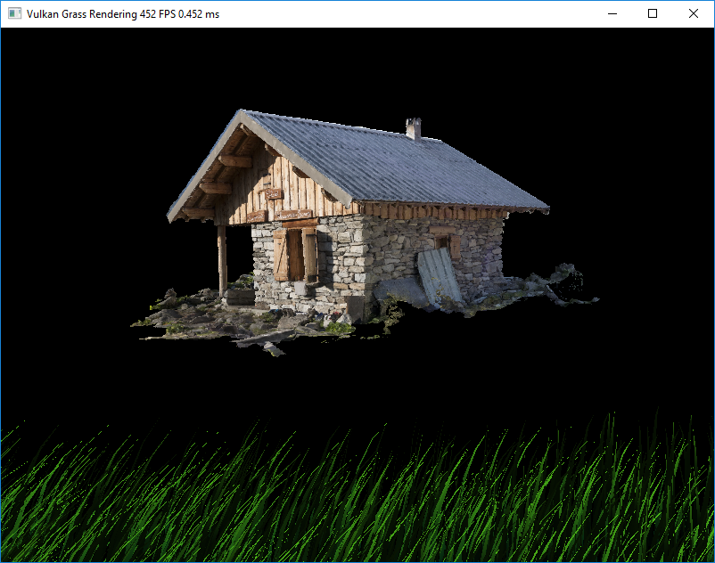
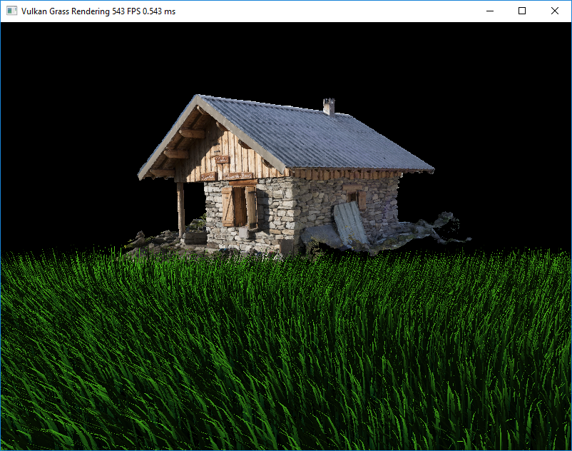
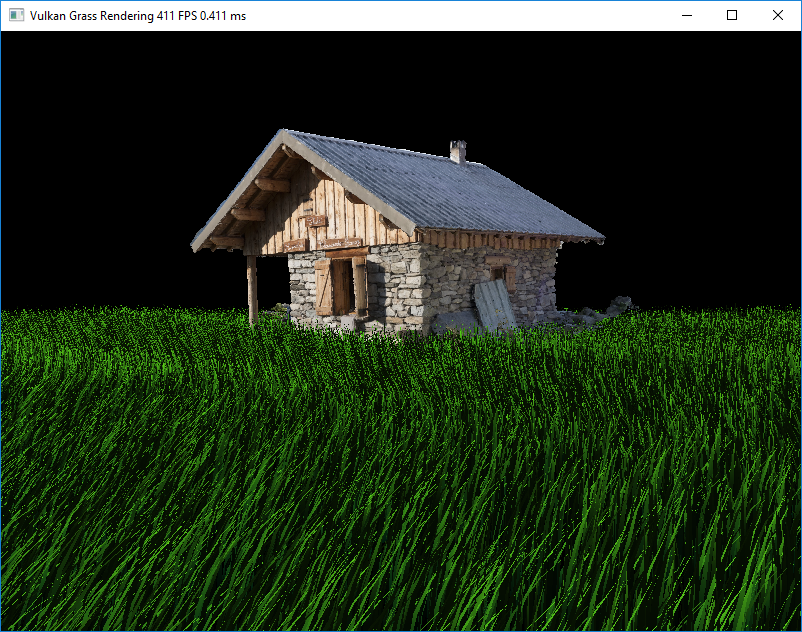
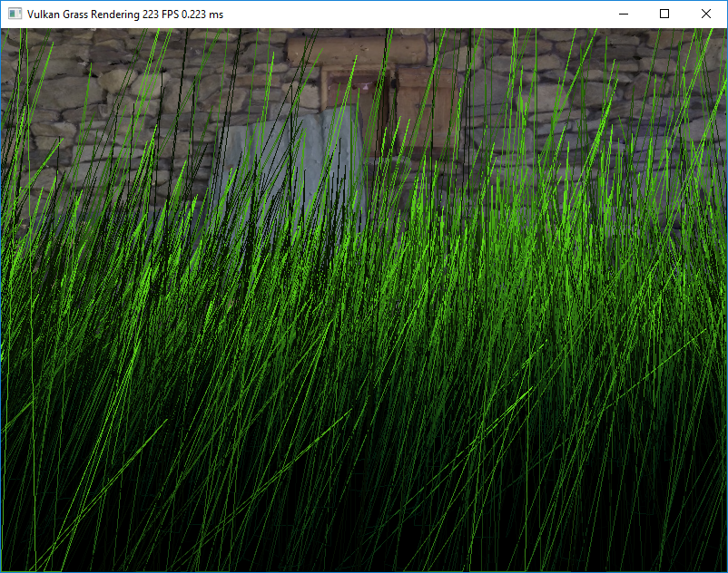
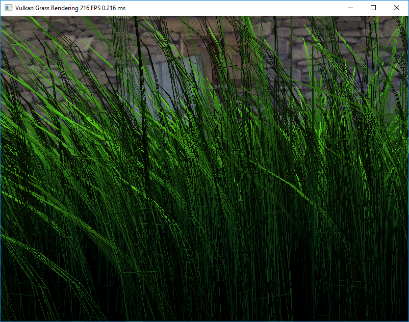
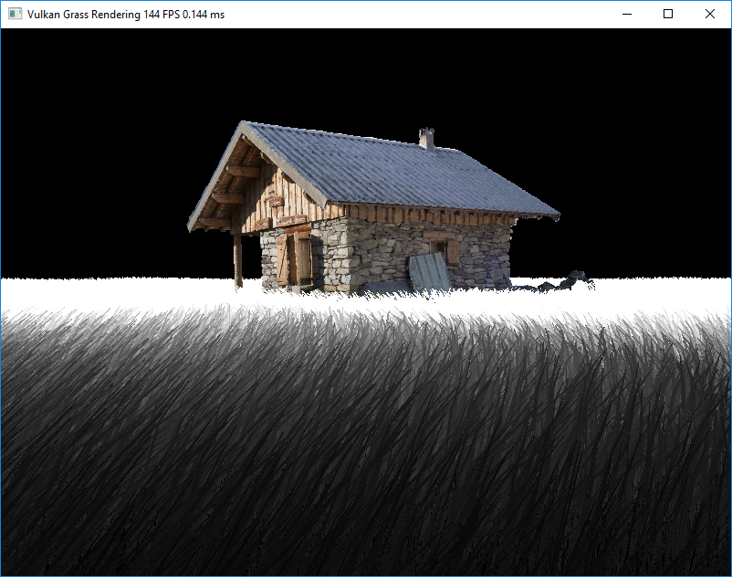
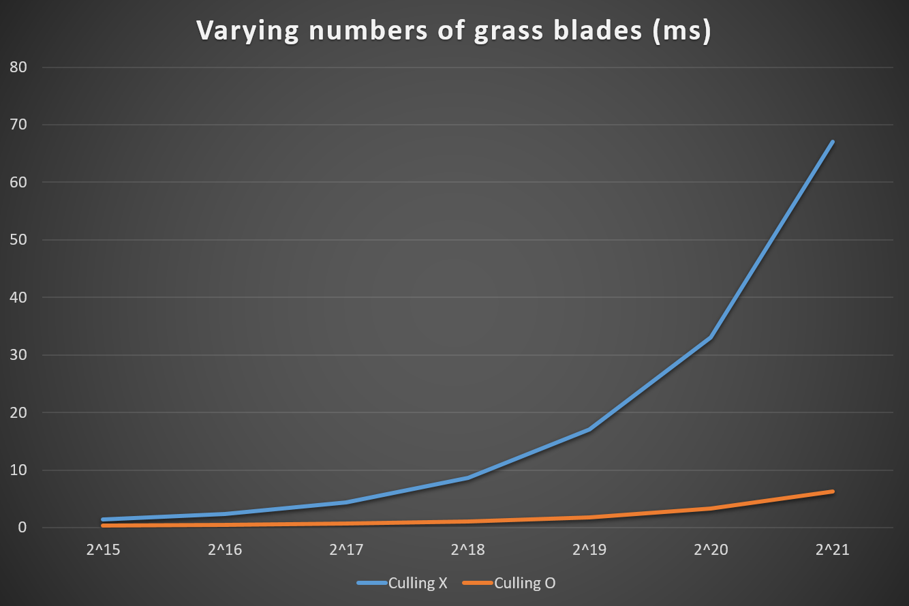
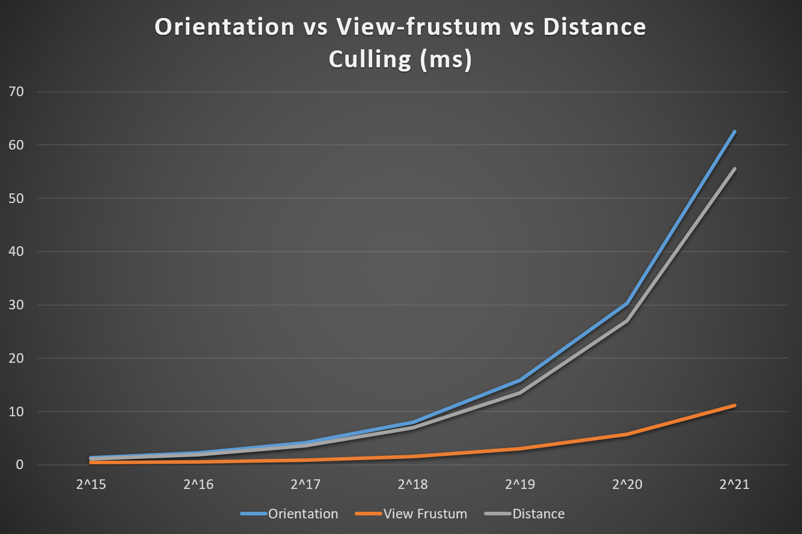

Vulkan Grass Rendering
========================

**University of Pennsylvania, CIS 565: Vulkan Grass Rendering, Project 6**

* Byumjin Kim
* Tested on: Windows 10, i7-6700HQ @ 2.60GHz 15.89GB GTX 1060(Personal labtop)

### Overview

In this project, I implemented the contents of the paper, [Responsive Real-Time Grass Rendering for General 3D Scenes](https://www.cg.tuwien.ac.at/research/publications/2017/JAHRMANN-2017-RRTG/JAHRMANN-2017-RRTG-draft.pdf) with using Vulkan to implement a grass simulator and renderer.  
I used compute shaders to perform physics calculations on Bezier curves that represent individual
grass blades in your application.  Since rendering every grass blade on every frame will is fairly
inefficient, I also used compute shaders to cull grass blades that don't contribute to a given frame.  
I wrote a vertex shader to transform Bezier control points, tessellation shaders to dynamically create
the grass geometry from the Bezier curves, and a fragment shader to shade the grass blades. 

< Straight wave >

< Helicopter wave >

< Helicopter wave >

### Complete requirements

- Basic Features
	- Compute shader
		- Representing Grass as Bezier Curves
		- Simulating Forces
		- Culling tests (Orientation, View-frustum, Distance)
	- Grass pipeline stages
		- Vertex shade
		- Tessellation control shader
		- Tessellation evaluation shader
		- Fragment shader
- Additional Features
	- Tessellate to varying levels of detail 

#### Simulating Forces

In additional, with windDirectionalAlignment from paper, I also made stronger stiffness value for vertices close to the ground. 
Because, the wind force is not the only force to restict grass' movement.  

#### Culling tests

When we do View-frustum culling, if we just clip our grass with NDC values, and if we change the direction of view rapidly, empty area can be generated. 
Simply, instead of cliping with 1.0 and -1.0 value for X and Y coordinate, using larger values, in terms of absoulte value, can address this problem. 
And, I tested 5 positions (v0, v2, mid point ((1/4)v0 * (1/2)v1 * (1/4)v2), mid point between v0 and mid, mid point between mid and v2) whether it should be clipped or not.  
Because, it seemed still not enough to decide it with just using 3 points.  

|  Threshold | 0.2 | 0.5 | 0.8 | 
| ---------- | --- | --- | --- |
| View-frustum culling |  |  |  |

#### Tessellation for varying levels of detail 

|  LOD | Min | Max | Blend Value (more white gives lower LOD) | 
| ----------- | ----------- | ----------- | ----------- |
| Tessellation |  |  |  |

### Performance Analysis

#### Varying numbers of grass blades

Resolution		 		       : 800 x 600 

 

|  Number of blades  | 2^15 | 2^16 | 2^17 | 2^18 | 2^19 | 2^20 | 2^21 |
| ------------------ | ---- | ---- | ---- | ---- | ---- | ---- | ---- |
|   without culling  | 1.40 | 2.40 | 4.40 | 8.60 | 17.0 | 33.0 | 67.0 |
|  with all culling  | 0.37 | 0.47 | 0.70 | 1.02 | 1.73 | 3.28 | 6.33 |

#### Orientation culling vs View-frustum culling vs Distance culling

Resolution				       : 800 x 600 
Orientation's Threshold        : 0.9 
View-frustum's clipping value  : 1.3 
Distance's Threshold           : 0.9 

 

|  Number of blades  | 2^15 | 2^16 | 2^17 | 2^18 | 2^19 | 2^20 | 2^21 |
| ------------------ | ---- | ---- | ---- | ---- | ---- | ---- | ---- |
|     Orientation    | 1.38 | 2.25 | 4.20 | 8.00 | 15.9 | 30.3 | 62.5 |
|    View-frustum    | 0.46 | 0.60 | 0.93 | 1.56 | 3.00 | 5.71 | 11.1 |
|      Distance      | 1.13 | 1.94 | 3.61 | 6.99 | 13.5 | 27.0 | 55.5 |